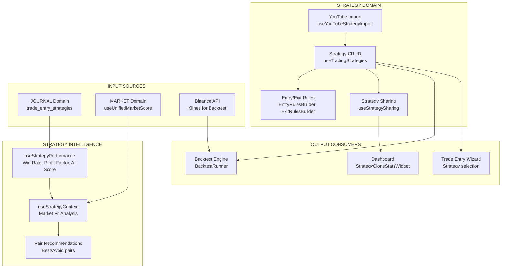
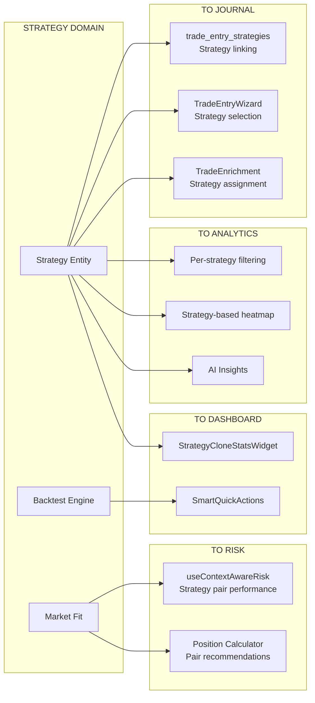
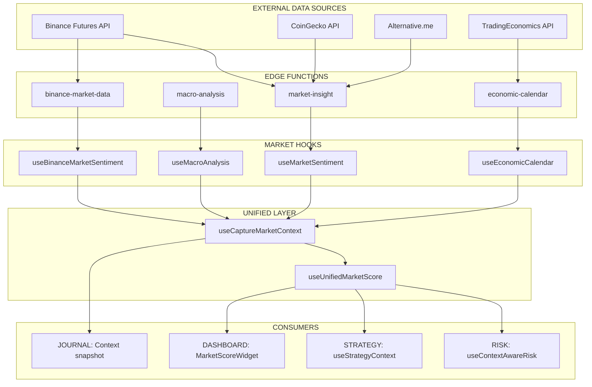

# Comprehensive Trading Domain Cross-Check Audit & Remediation Plan V12

## Status: ✅ STEP 6 (MARKET) COMPLETE
**Tanggal Audit**: 2026-01-31
**Domain Identification**: COMPLETED (Step 1)
**ACCOUNTS Domain**: COMPLETED (Foundation)
**JOURNAL Domain**: COMPLETED (Step 2)
**ANALYTICS Domain**: COMPLETED (Step 3)
**RISK Domain**: COMPLETED (Step 4)
**STRATEGY Domain**: COMPLETED (Step 5)
**MARKET Domain**: COMPLETED (Step 6)
**Next Step**: DASHBOARD Domain Audit (Step 7)
**Basis Audit**: Menu-based domain analysis + Binance Futures Domain Model

---

## DOMAIN IDENTIFICATION (STEP 1) - COMPLETED

### Audit Sequence (CORRECTED)

| Step | Domain | Dependencies | Status |
|------|--------|--------------|--------|
| 1 | ACCOUNTS | None | ✅ DONE |
| 2 | JOURNAL | ACCOUNTS | ✅ DONE |
| 3 | ANALYTICS | JOURNAL, ACCOUNTS | ✅ DONE |
| 4 | RISK | ACCOUNTS, ANALYTICS | ✅ DONE |
| 5 | STRATEGY | External market data | ✅ DONE |
| 6 | MARKET | None (external APIs) | ✅ DONE |
| 7 | DASHBOARD | All domains (1-6) | 🔜 PENDING |
| 7 | DASHBOARD | All domains (1-6) | 🔜 PENDING |
| 8 | SETTINGS | None | 🔜 PENDING |
| 9 | USER | Auth system | 🔜 PENDING |
| 10 | INFRASTRUCTURE | None | 🔜 PENDING |

---

## STRATEGY DOMAIN AUDIT (STEP 5) - COMPLETED

### 5.1 Domain Definition

**Menu Entry Points**:
- Strategy & Rules (`/strategies`) - Library, Leaderboard, YouTube Import
- Backtest (`/backtest`) - Run Backtest, Compare Results

**Fungsi Domain**:
- Strategy CRUD (Create, Read, Update, Soft Delete)
- Entry/Exit Rules Builder (structured rule types)
- Backtesting engine with real Binance Futures Klines
- Strategy Sharing ecosystem (tokens, cloning, notifications)
- YouTube Strategy Importer (AI-powered extraction)
- Market Fit Analysis (volatility, trend, event risk)
- Pair Recommendations (historical win rate analysis)

### 5.2 Pages & Components Verified

| Page | Route | Components | Status |
|------|-------|------------|--------|
| StrategyManagement | `/strategies` | StrategyCard, StrategyStats, StrategyFormDialog, StrategyDetailDrawer, StrategyShareDialog, StrategyLeaderboard, YouTubeStrategyImporter | ✅ OK |
| Backtest | `/backtest` | BacktestRunner, BacktestComparison, BacktestResults | ✅ OK |
| SharedStrategy | `/shared/strategy/:token` | Public view for cloning | ✅ OK |

### 5.3 Core Hooks Verified

| Hook | File | Dependencies | Status |
|------|------|--------------|--------|
| `useTradingStrategies` | use-trading-strategies.ts | useAuth | ✅ OK |
| `useCreateTradingStrategy` | use-trading-strategies.ts | useAuth, queryClient | ✅ OK |
| `useUpdateTradingStrategy` | use-trading-strategies.ts | queryClient | ✅ OK |
| `useDeleteTradingStrategy` | use-trading-strategies.ts | queryClient (soft delete) | ✅ OK |
| `useStrategyPerformance` | use-strategy-performance.ts | useTradeEntries | ✅ OK |
| `useStrategyContext` | use-strategy-context.ts | useUnifiedMarketScore, useAuth | ✅ OK |
| `useStrategySharing` | use-strategy-sharing.ts | supabase RPC, queryClient | ✅ OK |
| `useSharedStrategy` | use-strategy-sharing.ts | supabase | ✅ OK |
| `useRunBacktest` | use-backtest.ts | edge function, useAuth | ✅ OK |
| `useBacktestHistory` | use-backtest.ts | useAuth | ✅ OK |
| `useYouTubeStrategyImport` | use-youtube-strategy-import.ts | edge function, useAuth | ✅ OK |

### 5.4 Integration Points Verified

| From | To | Data | Status |
|------|-----|------|--------|
| JOURNAL → STRATEGY | trade_entry_strategies | Many-to-many link | ✅ OK |
| STRATEGY → JOURNAL | useStrategyPerformance | Per-strategy win rate, P&L | ✅ OK |
| MARKET → STRATEGY | useStrategyContext | Market fit score | ✅ OK |
| STRATEGY → BACKTEST | BacktestRunner | Strategy rules → simulation | ✅ OK |

### 5.5 Data Flow Diagram



### 5.6 Business Rules Verified

| Rule | Implementation | Status |
|------|----------------|--------|
| Soft Delete | `is_active = false` on delete | ✅ OK |
| Share Token Generation | `generate_share_token()` RPC | ✅ OK |
| Clone Notification | `strategy-clone-notify` edge function | ✅ OK |
| AI Quality Score | Weighted: WR 40%, PF 30%, Consistency 20%, Sample 10% | ✅ OK |
| Market Fit Scoring | volatility + trend + session + events = 0-100 | ✅ OK |
| Pair Recommendation | Min 3 trades per pair for validity | ✅ OK |
| YouTube Import Validation | AI extraction + validation score | ✅ OK |

### 5.7 Cross-Domain Integration Map



### 5.8 Audit Result

**STRATEGY Domain Status**: ✅ **PASS** - No gaps identified

Key Findings:
1. **CRUD**: Complete with soft-delete pattern
2. **Rules System**: Structured entry/exit rules with type safety
3. **Performance Tracking**: AI Quality Score calculated from Journal trades
4. **Market Fit**: Real-time context analysis via `useStrategyContext`
5. **Sharing Ecosystem**: Token-based sharing with clone notifications
6. **YouTube Import**: AI-powered extraction via edge function
7. **Backtest**: Real Binance Klines, event/session/volatility filtering
8. **Journal Integration**: Many-to-many via `trade_entry_strategies` table

---

## MARKET DOMAIN AUDIT (STEP 6) - COMPLETED

### 6.1 Domain Definition

**Menu Entry Points**:
- Market Data (`/market-data`) - Sentiment, Volatility, Whale Tracking, Opportunities
- Market Insight (`/market-insight`) - AI Sentiment, Macro Analysis, Combined Analysis
- Economic Calendar (`/calendar`) - Economic events with crypto impact
- Top Movers (`/top-movers`) - Gainers, Losers, Volume Leaders

**Fungsi Domain**:
- Menyediakan Market Sentiment (bullish/bearish scores)
- Menyediakan Fear & Greed Index dengan label
- Menyediakan Volatility data (ATR-based levels)
- Menyediakan Economic Events dengan AI crypto impact predictions
- Menyediakan Whale Tracking (volume-based detection)
- Menyediakan Trading Opportunities (AI-ranked setups)
- Menyediakan Unified Market Score (composite 0-100)
- Menyediakan Trading Bias (LONG_FAVORABLE, SHORT_FAVORABLE, NEUTRAL, AVOID)

### 6.2 Pages & Components Verified

| Page | Route | Components | Status |
|------|-------|------------|--------|
| MarketData | `/market-data` | MarketSentimentWidget, VolatilityMeterWidget, WhaleTracking, TradingOpportunities | ✅ OK |
| MarketInsight | `/market-insight` | AIAnalysisTab, CombinedAnalysisCard | ✅ OK |
| EconomicCalendar | `/calendar` | CalendarTab | ✅ OK |
| TopMovers | `/top-movers` | MoverCard, MoversList (Gainers/Losers/Volume tabs) | ✅ OK |

### 6.3 Core Hooks Verified

| Hook | File | Dependencies | Status |
|------|------|--------------|--------|
| `useCaptureMarketContext` | use-capture-market-context.ts | useMarketSentiment, useMacroAnalysis, useEconomicCalendar, useBinanceMarketSentiment | ✅ OK |
| `useUnifiedMarketScore` | use-unified-market-score.ts | useCaptureMarketContext | ✅ OK |
| `useMarketSentiment` | features/market-insight | edge function: market-insight | ✅ OK |
| `useMacroAnalysis` | features/market-insight | edge function: macro-analysis | ✅ OK |
| `useCombinedAnalysis` | features/market-insight | useMarketSentiment, useMacroAnalysis | ✅ OK |
| `useMarketAlerts` | features/market-insight | useMarketSentiment (toast alerts) | ✅ OK |
| `useEconomicCalendar` | features/calendar | edge function: economic-calendar | ✅ OK |
| `useMultiSymbolMarketInsight` | features/market-insight | edge function: market-insight (dynamic symbols) | ✅ OK |
| `useBinanceTopMovers` | features/binance | edge function: binance-market-data | ✅ OK |
| `useBinanceMarketSentiment` | features/binance | edge function: binance-market-data | ✅ OK |

### 6.4 Global State Verified

| Context | File | Data | Status |
|---------|------|------|--------|
| MarketContext | contexts/MarketContext.tsx | selectedSymbol, watchlist | ✅ OK |

**Persistence**: localStorage via `trading-journey-market-context` key

### 6.5 Integration Points Verified

| From | To | Data | Status |
|------|-----|------|--------|
| MARKET → RISK | useContextAwareRisk | Volatility adjustment, Event risk | ✅ OK |
| MARKET → STRATEGY | useStrategyContext | Market fit score | ✅ OK |
| MARKET → JOURNAL | useCaptureMarketContext | Context snapshot at trade entry | ✅ OK |
| MARKET → DASHBOARD | MarketScoreWidget | Score, bias, event warnings | ✅ OK |
| MARKET → CALCULATOR | ContextWarnings | Event/volatility alerts | ✅ OK |

### 6.6 Data Flow Diagram



### 6.7 Business Rules Verified

| Rule | Implementation | Status |
|------|----------------|--------|
| Fear/Greed Thresholds | <=25 Extreme Fear, >=75 Extreme Greed | ✅ OK |
| Volatility Levels | Low (<2%), Medium (2-4%), High (>4%) | ✅ OK |
| Event Risk Levels | LOW, MODERATE, HIGH, VERY_HIGH | ✅ OK |
| Position Adjustment | normal, reduce_30%, reduce_50% | ✅ OK |
| Trading Bias | LONG_FAVORABLE, SHORT_FAVORABLE, NEUTRAL, AVOID | ✅ OK |
| Composite Score Weights | Technical 30%, OnChain 20%, F&G 20%, Macro 15%, Events 15% | ✅ OK |

### 6.8 Audit Result

**MARKET Domain Status**: ✅ **PASS** - No gaps identified

Key Findings:
1. **Data Aggregation**: 4 external sources (Binance, CoinGecko, Alternative.me, TradingEconomics)
2. **Edge Functions**: 4 dedicated functions for data processing
3. **Unified Score**: Composite 0-100 score with component breakdown
4. **Trading Bias**: Actionable recommendations (LONG/SHORT/NEUTRAL/AVOID)
5. **Event Integration**: Economic events with AI crypto impact predictions
6. **Context Capture**: Snapshot mechanism for trade entry enrichment
7. **Global State**: MarketContext with localStorage persistence
8. **Cross-Domain**: Clean integration with RISK, STRATEGY, JOURNAL, DASHBOARD

---

### 4.1 Domain Definition

**Menu Entry Points**:
- Risk Management (`/risk`) - Overview, Settings, History
- Risk Calculator (`/calculator`) - Position sizing with context

**Fungsi Domain**:
- Menyediakan parameter risk profile (risk per trade, max daily loss, etc.)
- Menghitung dan menampilkan Daily Loss Tracker dengan gauge visual
- Menyediakan Trading Gate (auto-lock saat limit tercapai)
- Menampilkan Correlation Matrix antar open positions
- Menyediakan Position Size Calculator dengan context-aware risk

### 4.2 Pages & Components Verified

| Page | Route | Components | Status |
|------|-------|------------|--------|
| RiskManagement | `/risk` | DailyLossTracker, RiskSettingsForm, CorrelationMatrix, RiskEventLog | ✅ OK |
| PositionCalculator | `/calculator` | CalculatorInputs/Results, VolatilityStopLoss, MarketScoreWidget, ContextWarnings | ✅ OK |

### 4.3 Core Hooks Verified

| Hook | File | Dependencies | Status |
|------|------|--------------|--------|
| `useRiskProfile` | use-risk-profile.ts | useAuth | ✅ OK |
| `useTradingGate` | use-trading-gate.ts | useBestAvailableBalance, useUnifiedDailyPnl, useTradeEntries | ✅ OK |
| `useDailyRiskStatus` | use-risk-profile.ts | useRiskProfile, useBinanceDailyPnl, useBinanceTotalBalance | ✅ OK |
| `useContextAwareRisk` | use-context-aware-risk.ts | useRiskProfile, useUnifiedMarketScore, useBinanceVolatility, useTradeEntries | ✅ OK |
| `usePreTradeValidation` | features/trade/ | useRiskProfile, useTradeEntries | ✅ OK |
| `useRiskEvents` | use-risk-events.ts | useAuth | ✅ OK |

### 4.4 Integration Points Verified

| From | To | Data | Status |
|------|-----|------|--------|
| ACCOUNTS → RISK | useBestAvailableBalance | Wallet balance | ✅ OK |
| ANALYTICS → RISK | useUnifiedDailyPnl | Today's P&L | ✅ OK |
| RISK → JOURNAL | useTradingGate | canTrade boolean | ✅ OK |
| RISK → DASHBOARD | SystemStatusIndicator | 🟢🟡🔴 status | ✅ OK |

### 4.5 Business Rules Verified

| Rule | Implementation | Status |
|------|----------------|--------|
| 70% Warning | `RISK_THRESHOLDS.warning_percent = 70` | ✅ OK |
| 90% Danger | `RISK_THRESHOLDS.danger_percent = 90` | ✅ OK |
| 100% Disabled | `useTradingGate.status === 'disabled'` | ✅ OK |
| AI Quality Block | Avg score < 30% on last 3 trades | ✅ OK |
| Correlation Warning | Static map with >70% threshold | ✅ OK |

### 4.6 Data Flow Diagram


### 4.6b RISK Domain Cross-Domain Integration


### 4.7 Audit Result

**RISK Domain Status**: ✅ **PASS** - No gaps identified

---

## JOURNAL DOMAIN AUDIT (STEP 2) - COMPLETED

### Pages & Components Verified
- `/journal` (TradingJournal.tsx) - Pending & Active positions management
- `/history` (TradeHistory.tsx) - Closed trades with filters, AI sorting, enrichment

### Core Hooks Verified
- `useTradeEntries()` - CRUD dengan strategy linking, screenshots JSONB
- `useBinanceSync()` / `useBulkSyncTrades()` - Duplicate detection via binance_trade_id
- `useClosePosition()` - Lifecycle transition, result auto-calculation, AI trigger
- `usePostTradeAnalysis()` - Async post-trade AI analysis

### Data Flow Verified
- **IN**: Binance API (positions/trades), Market Context (Fear/Greed saat capture)
- **OUT**: Analytics (useTradeEntries), Risk (useUnifiedDailyPnl), Dashboard

### Calculations Verified (`trading-calculations.ts`)
- Win Rate, Profit Factor, Expectancy, Sharpe Ratio, Max Drawdown
- R:R calculation with direction awareness
- Equity curve generation

### Integration Points Verified
- Trading Gate integration dalam TradeEntryWizard
- TradeEnrichmentDrawer untuk Binance & Paper trades
- Express Mode (3 steps) vs Full Mode (5 steps)

### Domain Map (CORRECTED)

```
┌─────────────────────────────────────────────────────────────────────┐
│              TRADING JOURNEY - DOMAIN HIERARCHY                     │
├─────────────────────────────────────────────────────────────────────┤
│                                                                     │
│  LAYER 1: FOUNDATION                                               │
│  ┌─────────────────────────────────────────────────────────────┐   │
│  │ ACCOUNTS Domain                                             │   │
│  │ ├─ Balance & Capital management                             │   │
│  │ └─ IN: Binance API, local paper accounts                    │   │
│  └─────────────────────────────────────────────────────────────┘   │
│                 ↓                                                   │
│  LAYER 2: CORE TRADING                                             │
│  ┌─────────────────────────────────────────────────────────────┐   │
│  │ JOURNAL Domain                                              │   │
│  │ ├─ Trade entry & recording                                  │   │
│  │ ├─ Trade history & lifecycle                                │   │
│  │ └─ IN: Trade executions (Binance/manual)                    │   │
│  └─────────────────────────────────────────────────────────────┘   │
│         ↓                ↓                ↓                         │
│  LAYER 3: ANALYSIS & DECISION                                      │
│  ┌──────────────┐  ┌──────────────┐  ┌──────────────┐              │
│  │ ANALYTICS    │  │ RISK         │  │ STRATEGY     │              │
│  │ ─────────────│  │ ─────────────│  │ ─────────────│              │
│  │ • Performance│  │ • Risk limit │  │ • Rules def. │              │
│  │ • P&L charts│  │ • Position sz│  │ • Backtest   │              │
│  │ • Heatmap   │  │ • Loss track │  │ • Sharing    │              │
│  │ • Insights  │  │              │  │              │              │
│  │ • Export    │  │              │  │              │              │
│  └──────────────┘  └──────────────┘  └──────────────┘              │
│         ↑                ↑                                          │
│         └────────────────┘                                         │
│         (P&L, daily limits)                                        │
│                                                                     │
│  LAYER 4: CONTEXT                                                  │
│  ┌─────────────────────────────────────────────────────────────┐   │
│  │ MARKET Domain                                               │   │
│  │ ├─ Market data, events, sentiment                           │   │
│  │ └─ IN: External APIs only                                   │   │
│  └─────────────────────────────────────────────────────────────┘   │
│                 ↓                                                   │
│  LAYER 5: ENTRY POINT                                              │
│  ┌─────────────────────────────────────────────────────────────┐   │
│  │ DASHBOARD Domain                                            │   │
│  │ ├─ Overview & navigation                                    │   │
│  │ └─ Aggregates: Accounts, Journal, Analytics, Risk, Market   │   │
│  └─────────────────────────────────────────────────────────────┘   │
│                                                                     │
│  LAYER 6: SUPPORTING                                               │
│  ┌──────────────┐  ┌──────────────┐                               │
│  │ SETTINGS     │  │ USER         │                               │
│  │ ─────────────│  │ ─────────────│                               │
│  │ • API config │  │ • Profile    │                               │
│  │ • Preferences│  │ • Notif      │                               │
│  └──────────────┘  └──────────────┘                               │
│                                                                     │
│  LAYER 7: PLATFORM                                                 │
│  ┌─────────────────────────────────────────────────────────────┐   │
│  │ INFRASTRUCTURE (Cross-cutting)                              │   │
│  │ ├─ Command Palette (search)                                 │   │
│  │ ├─ Theme toggle                                             │   │
│  │ └─ Currency display                                         │   │
│  └─────────────────────────────────────────────────────────────┘   │
│                                                                     │
│  NOTE: Bulk Export moved from SETTINGS to ANALYTICS domain         │
│                                                                     │
└─────────────────────────────────────────────────────────────────────┘
```

### Corrections Applied

| No | Item | Original | Corrected | Impact |
|----|------|----------|-----------|--------|
| 1 | Audit Order | RISK→STRATEGY→ANALYTICS | ANALYTICS→RISK→STRATEGY | Critical |
| 2 | Bulk Export | SETTINGS group | ANALYTICS domain | Structural |
| 3 | Infrastructure | "Domain" label | "Platform Layer" | Terminology |

---

## STEP 2: ACCOUNTS DOMAIN AUDIT

**Audit Date**: 2026-01-31
**Status**: ✅ COMPLETED

### 2.1 Domain Definition

**Menu Entry Point**: Standalone `/accounts` (2nd item in sidebar after Dashboard)

**Fungsi Domain**:
- Menyediakan data balance & capital (Total Wallet Balance, Available Balance)
- Menyediakan Unrealized P&L dari open positions
- Mengelola Paper Trading accounts (CRUD, deposit, withdrawal)
- Menyediakan Transaction History (deposit/withdrawal Binance)
- Menyediakan Financial Summary (fees, funding, rebates)

**Domain Boundary**:
- **IN**: 
  - Binance API (`/fapi/v2/balance`, `/fapi/v2/positionRisk`, `/fapi/v1/income`)
  - Local Paper Accounts (`accounts` table in Supabase)
  - Account Transactions (`account_transactions` table)
- **OUT**: 
  - Balance data ke RISK, ANALYTICS, DASHBOARD
  - Account context ke JOURNAL (trade_entries.trading_account_id)

### 2.2 Data Sources Audit

| Data Type | Source | Endpoint/Table | Hook | Status |
|-----------|--------|----------------|------|--------|
| Total Wallet Balance | Binance API | `/fapi/v2/balance` | `useBinanceBalance()` | ✅ CORRECT |
| Available Balance | Binance API | `/fapi/v2/balance` | `useBinanceBalance()` | ✅ CORRECT |
| Unrealized P&L | Binance API | `/fapi/v2/positionRisk` | `useBinanceBalance()` | ✅ CORRECT |
| Active Positions | Binance API | `/fapi/v2/positionRisk` | `useBinancePositions()` | ✅ CORRECT |
| Paper Account Balance | Supabase | `accounts.balance` | `useAccounts()` | ✅ CORRECT |
| Account Transactions | Supabase | `account_transactions` | `useAccountTransactions()` | ✅ CORRECT |
| Binance Transfers | Binance API | `/fapi/v1/income` (TRANSFER) | `useBinanceTransactionHistory()` | ✅ CORRECT |
| Fees/Funding | Binance API | `/fapi/v1/income` | `useBinanceAllIncome()` | ✅ CORRECT |

### 2.3 Implementation Audit

#### 2.3.1 Accounts Page Structure (`/accounts`)

**File**: `src/pages/Accounts.tsx`

**Tabs**:
| Tab | Content | Status |
|-----|---------|--------|
| Accounts | Merged Binance + Paper accounts | ✅ CORRECT |
| Transactions | Binance deposit/withdrawal history | ✅ CORRECT |
| Financial | Fee/Funding/Rebate summary | ✅ CORRECT |

**Overview Cards** (Top of page):
| Card | Data Source | Display | Status |
|------|-------------|---------|--------|
| Total Accounts | Calculated | `{binance + paperCount}` | ✅ CORRECT |
| Total Balance | `useBinanceBalance()` | `totalWalletBalance` | ✅ CORRECT |
| Active Positions | `useBinancePositions()` | Count + Unrealized P&L | ✅ CORRECT |

**Binance Section** (when connected):
| Card | Data | Status |
|------|------|--------|
| Wallet Balance | `balance.totalWalletBalance` | ✅ CORRECT |
| Available | `balance.availableBalance` | ✅ CORRECT |
| Unrealized P&L | `balance.totalUnrealizedProfit` | ✅ CORRECT |

**Paper Trading Section**:
- `AddAccountForm` for creating new paper accounts | ✅ CORRECT
- `AccountCardList` with `filterType="trading"` + `backtestOnly` | ✅ CORRECT

#### 2.3.2 Financial Summary Card (`FinancialSummaryCard.tsx`)

**Income Type Segregation**:
```typescript
// Line 82-86: Correctly filters non-trade income
return allIncome.filter((item: BinanceIncome) => {
  const category = getIncomeTypeCategory(item.incomeType);
  return category === 'fees' || category === 'funding' || category === 'rewards';
});
```

**Display Breakdown**:
| Metric | Source | Display | Status |
|--------|--------|---------|--------|
| Trading Fees | COMMISSION | `-${totalFees}` | ✅ CORRECT |
| Funding Paid | FUNDING_FEE (negative) | `-${fundingPaid}` | ✅ CORRECT |
| Funding Received | FUNDING_FEE (positive) | `+${fundingReceived}` | ✅ CORRECT |
| Fee Rebates | COMMISSION_REBATE, API_REBATE | `+${totalRebates}` | ✅ CORRECT |
| Net Trading Cost | Calculated | `fees + fundingPaid - fundingReceived - rebates` | ✅ CORRECT |

#### 2.3.3 Transaction History (`BinanceTransactionHistory.tsx`)

**Data Source**: `useBinanceTransactionHistory()` → filters `TRANSFER` type from income

**Summary Cards**:
| Card | Calculation | Status |
|------|-------------|--------|
| Total Deposits | Sum of DEPOSIT type | ✅ CORRECT |
| Total Withdrawals | Sum of WITHDRAWAL type | ✅ CORRECT |
| Net Flow | Deposits - Withdrawals | ✅ CORRECT |

#### 2.3.4 Combined Balance Hook (`use-combined-balance.ts`)

**Purpose**: Single source of balance for components that need account-agnostic balance

**Logic**:
```
1. If Binance connected → use Binance balance
2. Else if paperAccountId specified → use that account
3. Else → sum all active trading accounts
```

**Status**: ✅ CORRECT - Properly prioritizes Binance as source of truth

### 2.4 Dependencies (Data Flow OUT)

#### To RISK Domain

| Hook/Component | Uses | For |
|----------------|------|-----|
| `use-trading-gate.ts` | `useBinanceDailyPnl()` → `totalBalance` | Daily loss limit base |
| `RiskSummaryCard.tsx` | Balance for loss % calculation | Loss limit progress |
| `PositionCalculator.tsx` | `useBestAvailableBalance()` | Position sizing base |

**Verification**: ✅ CORRECT - Risk uses live Binance balance

#### To ANALYTICS Domain

| Hook/Component | Uses | For |
|----------------|------|-----|
| `PortfolioOverviewCard.tsx` | `useBinanceTotalBalance()` | Total Capital display |
| `Performance.tsx` | Balance for Return % | Performance metrics |
| `DailyPnL.tsx` | Balance for daily % change | Daily analytics |

**Verification**: ✅ CORRECT - Analytics uses live Binance balance

#### To DASHBOARD Domain

| Component | Uses | For |
|-----------|------|-----|
| `PortfolioOverviewCard.tsx` | `useBinanceTotalBalance()` | First widget display |
| `TodayPerformance.tsx` | Daily P&L calculations | Performance cards |

**Verification**: ✅ CORRECT - Dashboard aggregates correctly

#### To JOURNAL Domain

| Component | Uses | For |
|-----------|------|-----|
| `TradeEntryWizard.tsx` | `useBinanceBalance()` | Balance context for trade entry |
| `OpenPositionsTable.tsx` | `useBinancePositions()` | Show active positions |

**Verification**: ✅ CORRECT - Journal has access to account context

### 2.5 Gap Analysis

| Area | Expected | Actual | Gap? |
|------|----------|--------|------|
| Binance Balance Display | Live from API | Live from API | ✅ NO GAP |
| Paper Account Management | CRUD + Transactions | CRUD + Transactions | ✅ NO GAP |
| Financial Summary | Fee/Funding/Rebate breakdown | Fee/Funding/Rebate breakdown | ✅ NO GAP |
| Transaction History | Deposits/Withdrawals | Deposits/Withdrawals | ✅ NO GAP |
| Data Flow to RISK | Live balance | Live balance | ✅ NO GAP |
| Data Flow to ANALYTICS | Live balance | Live balance | ✅ NO GAP |
| Data Flow to DASHBOARD | Live balance | Live balance | ✅ NO GAP |

### 2.6 UI/UX Audit

| Aspect | Status | Notes |
|--------|--------|-------|
| Information Hierarchy | ✅ GOOD | Overview cards → Tabs → Detail sections |
| Progressive Disclosure | ✅ GOOD | Collapsible details in Financial Summary |
| Not Connected State | ✅ GOOD | Clear CTA to configure API keys |
| Loading States | ✅ GOOD | Skeletons for all async data |
| Separation of Concerns | ✅ GOOD | Binance section vs Paper section clearly separated |
| Mental Model Alignment | ✅ GOOD | Trader expects: Balance, Positions, Transactions, Fees |

### 2.7 Audit Result Summary

| Category | Result |
|----------|--------|
| Data Sources | ✅ CORRECT |
| Data Flow | ✅ CORRECT |
| Calculations | ✅ CORRECT |
| UI Display | ✅ CORRECT |
| Dependencies | ✅ CORRECT |
| Integration | ✅ CORRECT |

**ACCOUNTS Domain Status**: ✅ **PASS** - No gaps identified

### 2.8 Minor Observations (Non-Critical)

| Observation | Severity | Recommendation |
|-------------|----------|----------------|
| AccountDetail page links to `/trading-journey/journal` (old route) | LOW | Update to `/trading` |
| Paper account doesn't show P&L in AccountDetail | INFO | P&L comes from linked trades (by design) |

---

## STEP 3: ANALYTICS DOMAIN AUDIT

**Audit Date**: 2026-01-31
**Status**: ✅ COMPLETED

### 3.1 Domain Definition

**Menu Entry Points**: 
- Performance Overview (`/performance`)
- Daily P&L (`/daily-pnl`)
- Trading Heatmap (`/heatmap`)
- AI Insights (`/ai-insights`)
- Bulk Export (`/export`) - moved from SETTINGS

**Fungsi Domain**:
- Mengagregasi trade data untuk performance metrics (Win Rate, Profit Factor, Sharpe)
- Menyediakan Daily/Weekly P&L breakdown dengan symbol analysis
- Visualisasi temporal performance (Heatmap, Session, Streak)
- AI-powered pattern recognition dan recommendations
- Export data untuk tax reporting dan backup

**Domain Boundary**:
- **IN**: 
  - JOURNAL (`trade_entries` via `useTradeEntries()`)
  - ACCOUNTS (`balance` via `useBinanceDailyPnl()`, `useBinanceWeeklyPnl()`)
  - MARKET (context via `market_context` column in trade_entries)
- **OUT**: 
  - Daily P&L data ke RISK (via `useUnifiedDailyPnl()`)
  - Performance metrics ke DASHBOARD

### 3.2 Pages & Components Audit

#### 3.2.1 Performance Overview (`/performance`)

**File**: `src/pages/Performance.tsx` (598 lines)

**Tabs**:
| Tab | Content | Status |
|-----|---------|--------|
| Overview | Key metrics + Equity curve + Charts | ✅ CORRECT |
| Strategies | Per-strategy performance breakdown | ✅ CORRECT |

**Key Metrics Cards**:
| Metric | Calculation | Status |
|--------|-------------|--------|
| Win Rate | `wins / totalTrades * 100` | ✅ CORRECT |
| Profit Factor | `grossProfit / grossLoss` | ✅ CORRECT |
| Expectancy | `(winRate * avgWin - lossRate * avgLoss)` | ✅ CORRECT |
| Max Drawdown | Peak-to-trough calculation | ✅ CORRECT |
| Sharpe Ratio | Risk-adjusted return | ✅ CORRECT |
| Avg R:R | Average reward-to-risk ratio | ✅ CORRECT |

**Contextual Features**:
| Feature | Component | Status |
|---------|-----------|--------|
| Event Day Filter | Switch + Badge | ✅ CORRECT |
| Equity Curve with Events | `EquityCurveWithEvents` | ✅ CORRECT |
| Fear/Greed Zone Chart | `FearGreedZoneChart` | ✅ CORRECT |
| Volatility Level Chart | `VolatilityLevelChart` | ✅ CORRECT |
| Combined Contextual Score | `CombinedContextualScore` | ✅ CORRECT |

**Data Sources**:
| Hook | Purpose | Status |
|------|---------|--------|
| `useTradeEntries()` | Trade data | ✅ CORRECT |
| `useTradingStrategies()` | Strategy filtering | ✅ CORRECT |
| `useBinanceDailyPnl()` | Live Binance P&L | ✅ CORRECT |
| `useBinanceWeeklyPnl()` | 7-day P&L | ✅ CORRECT |
| `useContextualAnalytics()` | Market context analysis | ✅ CORRECT |

**Export**:
| Format | Handler | Status |
|--------|---------|--------|
| CSV | `exportToCSV()` | ✅ CORRECT |
| PDF | `exportToPDF()` | ✅ CORRECT |

#### 3.2.2 Daily P&L (`/daily-pnl`)

**File**: `src/pages/DailyPnL.tsx` (383 lines)

**Binance Requirement**: ✅ Shows empty state if not connected

**Sections**:
| Section | Content | Status |
|---------|---------|--------|
| Today's P&L | Realized P&L, Commission, Trades, Win Rate | ✅ CORRECT |
| Week Comparison | This Week vs Last Week (P&L, Trades, WinRate) | ✅ CORRECT |
| Best/Worst Trade | 7-day best and worst trade | ✅ CORRECT |
| 7-Day Trend | Bar chart with daily P&L | ✅ CORRECT |
| Symbol Breakdown | Per-pair P&L with fees | ✅ CORRECT |

**Data Sources**:
| Hook | Purpose | Status |
|------|---------|--------|
| `useBinanceDailyPnl()` | Today's P&L from income endpoint | ✅ CORRECT |
| `useBinanceWeeklyPnl()` | 7-day data | ✅ CORRECT |
| `useBinanceWeekComparison()` | Week-over-week comparison | ✅ CORRECT |

**Symbol Breakdown Logic**:
```typescript
// Line 59-77: Correctly uses binanceStats.bySymbol
return Object.entries(binanceStats.bySymbol)
  .filter(([symbol]) => symbol !== 'N/A')
  .map(([symbol, data]) => ({
    symbol,
    trades: data.count,
    pnl: data.pnl,
    fees: data.fees,
    net: data.pnl - data.fees + data.funding + data.rebates,
  }))
```

**Status**: ✅ CORRECT - Uses real Binance data, properly segregated

#### 3.2.3 Trading Heatmap (`/heatmap`)

**File**: `src/pages/TradingHeatmap.tsx` (452 lines)

**Filters**:
| Filter | Options | Status |
|--------|---------|--------|
| Date Range | 7d, 30d, 90d, All | ✅ CORRECT |
| Pair | All pairs + specific | ✅ CORRECT |

**Session Performance**:
| Session | Hours | Status |
|---------|-------|--------|
| Asia | 00:00-08:00 | ✅ CORRECT |
| London | 08:00-16:00 | ✅ CORRECT |
| NY | 16:00-24:00 | ✅ CORRECT |

**Stats Cards**:
| Card | Calculation | Status |
|------|-------------|--------|
| Best Hour | Max P&L hour (min 2 trades) | ✅ CORRECT |
| Worst Hour | Min P&L hour (min 2 trades) | ✅ CORRECT |
| Longest Win Streak | Consecutive wins | ✅ CORRECT |
| Longest Loss Streak | Consecutive losses | ✅ CORRECT |

**Data Source**: `useTradeEntries()` → filters closed trades

**Export**: CSV export with day/hour grid data

**Status**: ✅ CORRECT

#### 3.2.4 AI Insights (`/ai-insights`)

**File**: `src/pages/AIInsights.tsx` (626 lines)

**Tabs**:
| Tab | Content | Status |
|-----|---------|--------|
| Pattern Analysis | AI-generated insights | ✅ CORRECT |
| Contextual Performance | Fear/Greed & Volatility segmentation | ✅ CORRECT |

**Pattern Analysis Features**:
| Feature | Component | Status |
|---------|-----------|--------|
| Quick Stats | Total P&L, Win Rate, Profit Factor, Streak | ✅ CORRECT |
| Pattern Insights | Generated from trade analysis | ✅ CORRECT |
| Action Items | Priority-based recommendations | ✅ CORRECT |
| Pair Rankings | Best/worst pairs with stats | ✅ CORRECT |
| Emotional Patterns | `EmotionalPatternAnalysis` | ✅ CORRECT |

**Contextual Performance**:
| Chart | Data | Status |
|-------|------|--------|
| Fear/Greed Bar Chart | Win rate by zone | ✅ CORRECT |
| Volatility Bar Chart | Win rate by level | ✅ CORRECT |
| Event Day Comparison | Event vs Normal day | ✅ CORRECT |

**Data Sources**:
| Hook | Purpose | Status |
|------|---------|--------|
| `useTradeEntries()` | Trade data | ✅ CORRECT |
| `useTradingStrategies()` | Strategy context | ✅ CORRECT |
| `useContextualAnalytics()` | Market context analysis | ✅ CORRECT |
| `useContextualExport()` | PDF export | ✅ CORRECT |

**Status**: ✅ CORRECT

#### 3.2.5 Bulk Export (`/export`)

**File**: `src/pages/BulkExport.tsx` (379 lines)

**Location Update**: ✅ Moved from SETTINGS to ANALYTICS (sidebar corrected)

**Tabs**:
| Tab | Content | Status |
|-----|---------|--------|
| Binance | Transaction/Order/Trade export | ✅ CORRECT |
| Journal | Trade entries export | ✅ CORRECT |
| Backup | Settings backup/restore | ✅ CORRECT |

**Binance Export Types**:
| Type | Data | Status |
|------|------|--------|
| Transaction | All income types (P&L, fees, funding) | ✅ CORRECT |
| Order | Order history | ✅ CORRECT |
| Trade | Trade execution history | ✅ CORRECT |

**Binance Requirement**: ✅ Shows alert if not connected

**Status**: ✅ CORRECT

### 3.3 Key Hooks Audit

#### 3.3.1 `useContextualAnalytics()` (367 lines)

**Purpose**: Segments trade performance by market conditions

**Segmentation Categories**:
| Category | Zones | Status |
|----------|-------|--------|
| Fear/Greed | extremeFear, fear, neutral, greed, extremeGreed | ✅ CORRECT |
| Volatility | low, medium, high | ✅ CORRECT |
| Event Proximity | eventDay, dayBefore, dayAfter, normalDay | ✅ CORRECT |

**Metrics Calculated**:
- trades, wins, losses, winRate, totalPnl, avgPnl, profitFactor

**Correlations** (Pearson):
- volatilityVsWinRate
- fearGreedVsWinRate
- eventDayVsPnl

**Insights Generated**:
| Insight Type | Trigger | Status |
|--------------|---------|--------|
| Fear Markets Favor You | Fear WR > Greed WR + 10% | ✅ CORRECT |
| Volatility Trading Edge | High WR > Low WR + 15% | ✅ CORRECT |
| Event Days Reduce Edge | Event WR < Normal WR - 10% | ✅ CORRECT |

**Data Quality Check**:
```typescript
dataQualityPercent: (tradesWithContext / closedTrades) * 100
```

**Status**: ✅ CORRECT

#### 3.3.2 `useUnifiedDailyPnl()` (NEW)

**Purpose**: Unified P&L source for Trading Gate (RISK domain)

**Logic**:
1. Checks `useBinanceConnectionStatus()`
2. If Binance connected → use `useBinanceDailyPnl()`
3. Else → calculate from `useTradeEntries()` for today

**Status**: ✅ CORRECT - Fixed after initial hook ordering issue

### 3.4 Data Flow OUT (to Other Domains)

#### To RISK Domain

| Hook/Component | Data Provided | Consumer | Status |
|----------------|---------------|----------|--------|
| `useUnifiedDailyPnl()` | `totalPnl`, `source` | `useTradingGate()` | ✅ CORRECT |
| `useBinanceDailyPnl()` | `grossPnl`, `totalCommission` | `RiskSummaryCard` | ✅ CORRECT |

#### To DASHBOARD Domain

| Component | Data | Consumer | Status |
|-----------|------|----------|--------|
| `useBinanceDailyPnl()` | Today's P&L | `TodayPerformance` | ✅ CORRECT |
| `useBinanceWeeklyPnl()` | 7-day trend | `DashboardAnalyticsSummary` | ✅ CORRECT |

### 3.5 Gap Analysis

| Area | Expected | Actual | Gap? |
|------|----------|--------|------|
| Performance Metrics | Win Rate, PF, Sharpe, Drawdown | All present | ✅ NO GAP |
| Daily P&L Breakdown | Gross, Fees, Net, Symbol | All present | ✅ NO GAP |
| Contextual Analytics | Fear/Greed, Vol, Event segmentation | All present | ✅ NO GAP |
| Temporal Analysis | Session, Day, Hour breakdown | All present | ✅ NO GAP |
| AI Insights | Patterns, Actions, Pair rankings | All present | ✅ NO GAP |
| Export Capabilities | CSV, PDF, Bulk | All present | ✅ NO GAP |
| Data Flow to RISK | Daily P&L | `useUnifiedDailyPnl()` | ✅ NO GAP |
| Bulk Export Location | ANALYTICS group | Moved to ANALYTICS | ✅ NO GAP |

### 3.6 UI/UX Audit

| Aspect | Status | Notes |
|--------|--------|-------|
| Empty States | ✅ GOOD | All pages handle no-data gracefully |
| Loading States | ✅ GOOD | Skeletons present |
| Binance Not Connected | ✅ GOOD | Clear messaging with CTA |
| Filters | ✅ GOOD | Date range, strategy, pair filters |
| Export Actions | ✅ GOOD | Prominent buttons in headers |
| Contextual Visuals | ✅ GOOD | Charts with proper legends |

### 3.7 Audit Result Summary

| Category | Result |
|----------|--------|
| Data Sources | ✅ CORRECT |
| Data Aggregation | ✅ CORRECT |
| Calculations | ✅ CORRECT |
| UI Display | ✅ CORRECT |
| Dependencies | ✅ CORRECT |
| Data Flow OUT | ✅ CORRECT |

**ANALYTICS Domain Status**: ✅ **PASS** - No gaps identified

### 3.8 Fixes Applied During Audit

| Issue | Fix | Status |
|-------|-----|--------|
| Bulk Export in wrong sidebar group | Moved from SETTINGS to ANALYTICS | ✅ FIXED |
| `useUnifiedDailyPnl` nested hook error | Refactored to use `useBinanceConnectionStatus` directly | ✅ FIXED |

---

## PREVIOUS IMPLEMENTATION SUMMARY (V6)

All 6 gap remediation phases have been successfully implemented:

| Phase | Description | Status |
|-------|-------------|--------|
| Phase 1 | Portfolio Overview Card (CRITICAL) | ✅ DONE |
| Phase 2 | AI Insights Enhancement | ✅ DONE |
| Phase 3 | Risk Summary Correlation | ✅ DONE |
| Phase 4 | Performance Net P&L | ✅ DONE |
| Phase 5 | DailyPnL Real Data | ✅ DONE |
| Phase 6 | R:R Guidance | ✅ DONE |

---

## SECTION A: EXECUTIVE SUMMARY (ORIGINAL AUDIT)

### Key Findings Summary - ALL RESOLVED

| Area | Status | Critical | Medium | Low |
|------|--------|----------|--------|-----|
| Income Type Separation | ✅ CORRECT | 0 | 0 | 0 |
| Trade Sync Logic | ✅ CORRECT | 0 | 0 | 0 |
| Financial Summary | ✅ CORRECT | 0 | 0 | 0 |
| Net P&L Calculation | ✅ CORRECT | 0 | 0 | 0 |
| Dashboard Portfolio Overview | ✅ DONE | 0 | 0 | 0 |
| AI Insights Widget | ✅ DONE | 0 | 0 | 0 |
| Performance P&L Display | ✅ DONE | 0 | 0 | 0 |
| DailyPnL Symbol Breakdown | ✅ DONE | 0 | 0 | 0 |
| Risk Correlation Warning | ✅ DONE | 0 | 0 | 0 |
| R:R Calculation | ✅ DONE | 0 | 0 | 0 |

**Total: 0 Critical, 0 Medium, 0 Low (All Resolved)**

---

## SECTION B: DOMAIN CORRECTNESS AUDIT

### B1: Income Type Separation (✅ CORRECT)

**Dokumentasi (`DOMAIN_MODEL.md` Line 30-41):**
```
| Income Type | Domain Entity | Is Trade? |
|-------------|---------------|-----------|
| REALIZED_PNL | Trade P&L | YES |
| COMMISSION | Trading Fee | NO |
| FUNDING_FEE | Funding Cost | NO |
```

**Implementasi (`use-binance-auto-sync.ts` Line 24-25):**
```typescript
const TRADE_INCOME_TYPES = ['REALIZED_PNL'] as const;
```

**Verifikasi:**
- ✅ Hanya `REALIZED_PNL` yang di-sync sebagai trade entry
- ✅ Fee/Funding/Transfer tidak tercampur dengan trade
- ✅ Sesuai dengan domain model Binance Futures

---

### B2: Financial Summary Display (✅ CORRECT)

**Dokumentasi (`BINANCE_INTEGRATION.md` Line 397-404):**
```
| Data | Display Location |
| COMMISSION | Financial Summary |
| FUNDING_FEE | Financial Summary |
```

**Implementasi (`FinancialSummaryCard.tsx` Line 79-87):**
```typescript
return allIncome.filter((item: BinanceIncome) => {
  const category = getIncomeTypeCategory(item.incomeType);
  // Exclude 'pnl' (trades) and 'transfers'
  return category === 'fees' || category === 'funding' || category === 'rewards';
});
```

**Verifikasi:**
- ✅ Fee/Funding dipisahkan dari trade dan ditampilkan di Financial Summary
- ✅ Trading Fee, Funding Paid/Received, Rebates breakdown
- ✅ Net Trading Cost calculation

---

### B3: Net P&L Calculation (✅ CORRECT)

**Dokumentasi (`DOMAIN_MODEL.md` Line 82-97):**
```typescript
const netPnl = grossPnl - totalCommission + totalFunding + totalRebates;
```

**Implementasi (`use-binance-daily-pnl.ts` Line 150-152):**
```typescript
// Calculate net P&L: Gross - Fees - Funding + Rebates
const netPnl = grossPnl - totalCommission + totalFunding + totalRebates;
```

**Verifikasi:**
- ✅ Formula Net P&L sesuai domain model
- ✅ Funding fee handled as signed value (+/-)
- ✅ Rebates ditambahkan ke P&L

---

### B4: Trade Sync Flow (✅ CORRECT)

**Dokumentasi (`BINANCE_INTEGRATION.md` Line 279-318):**
```
useBinanceAutoSync → Fetch Income (REALIZED_PNL) → Map to trade_entries
```

**Implementasi (`use-binance-auto-sync.ts` Line 141-151):**
```typescript
// Only sync REALIZED_PNL as trade entries
const pnlRecords = newRecords.filter((r: BinanceIncome) => r.incomeType === 'REALIZED_PNL');
const tradeEntries = pnlRecords.map((r: BinanceIncome) => 
  incomeToTradeEntry(r, user.id)
);
```

**Verifikasi:**
- ✅ Filter REALIZED_PNL sebelum insert
- ✅ Mapping ke trade_entries dengan binance_trade_id
- ✅ Duplicate detection via tranId

---

## SECTION C: GAP IDENTIFICATION

### C1: CRITICAL - Dashboard Missing Portfolio Overview

**Dokumentasi (`FEATURES.md` Line 9-20):**
Komponen Dashboard seharusnya:
- TodayPerformance ✅
- SmartQuickActions ✅
- MarketScoreWidget ✅
- RiskSummaryCard ✅
- **PortfolioOverviewCard** ❌ MISSING

**Implementasi (`Dashboard.tsx`):**
- Shows 7-Day Stats (streak, trades, best/worst day)
- Shows Active Positions dari Binance
- **NO Total Capital overview at top**
- **NO Today's Net P&L (Gross - Fees)**
- **NO Portfolio Value vs Initial**

**Expected Display:**
```
┌─────────────────────────────────────────────────────┐
│ Portfolio Overview                      [Binance]   │
├─────────────────────────────────────────────────────┤
│ $12,450.00          +$245.00 (+2.0%)    68.5% WR   │
│ Total Capital       Today's Net P&L     Win Rate   │
└─────────────────────────────────────────────────────┘
```

**Impact**: User tidak melihat total capital dan Net P&L overview di entry point utama.

---

### C2: MEDIUM - AI Insights Missing Correlation Warning

**Dokumentasi (`DOMAIN_MODEL.md` Line 213-224):**
```typescript
const CRYPTO_CORRELATIONS: Record<string, number> = {
  'BTCUSDT-ETHUSDT': 0.82,
  'BTCUSDT-BNBUSDT': 0.75,
  ...
};
const CORRELATION_WARNING_THRESHOLD = 0.6;
```

**Implementasi (`AIInsightsWidget.tsx`):**
- ✅ Summary, Recommendations, Risk Alerts
- ✅ Best Setups with confidence filtering
- ✅ Pair recommendations (focus/avoid based on win rate)
- ❌ **NO Correlation warning** between open positions
- ❌ **NO Market Regime badge** (Bullish/Bearish/Neutral)

**Impact**: User tidak aware tentang correlated exposure yang meningkatkan risiko.

---

### C3: MEDIUM - AI Insights Missing Market Regime Badge

**Current**: No market regime indicator at top of AI Insights widget.

**Expected:**
```tsx
<Badge className={getBiasColor(bias)}>
  {bias} Market | Score: {score} | Vol: {volatilityLabel}
</Badge>
```

**Data Source Available**: `useUnifiedMarketScore({ symbol: 'BTCUSDT' })`

---

### C4: MEDIUM - Performance Page P&L Uses Gross Only

**Dokumentasi (`DOMAIN_MODEL.md` Line 70-79):**
```
PERIOD ANALYTICS (Daily/Weekly/Monthly)
├── Total Gross P&L
├── Total Fees (commission + funding paid)
├── Total Net P&L
```

**Implementasi (`Performance.tsx` Line 398-404):**
```tsx
<Card>
  <CardHeader><CardTitle>Total P&L</CardTitle></CardHeader>
  <CardContent>
    <div className={`${stats.totalPnl >= 0 ? 'text-profit' : 'text-loss'}`}>
      {formatCurrency(stats.totalPnl)}
    </div>
  </CardContent>
</Card>
```

**Implementasi (`trading-calculations.ts` Line 144):**
```typescript
const totalPnl = trades.reduce((sum, t) => sum + (t.pnl || 0), 0);
```

**Issue:**
- Uses `pnl` from trade_entries
- Does NOT show Net P&L (after fees/funding)
- No breakdown: Gross → Fees → Net

**Impact**: Total P&L di Performance page tidak mencerminkan true Net P&L.

---

### C5: MEDIUM - DailyPnL Symbol Breakdown Uses Mock Data

**Implementasi (`DailyPnL.tsx` Line 58-71):**
```typescript
// Use mock aggregation - in real implementation this would come from detailed API
const symbols = ['BTCUSDT', 'ETHUSDT', 'SOLUSDT', 'XRPUSDT', 'DOGEUSDT'];
return symbols.slice(0, 5).map((symbol, i) => ({
  symbol,
  trades: Math.floor(weeklyStats.totalTrades / symbols.length) + ...
  pnl: weeklyStats.totalGross / symbols.length * (1 - i * 0.1),
```

**Issue:**
- Symbol breakdown adalah **hardcoded distribution**
- Tidak menggunakan data real dari `bySymbol` di hooks

**Data Source Available:**
```typescript
// use-binance-daily-pnl.ts Line 33-39
bySymbol: Record<string, { 
  pnl: number; 
  fees: number; 
  funding: number; 
  rebates: number;
  count: number;
}>
```

**Impact**: Per-symbol performance display tidak akurat.

---

### C6: MEDIUM - Risk Summary Missing Correlation Check

**Dokumentasi (`FEATURES.md` Line 209-215):**
```
Risk Management Features:
├── Daily Loss Tracker ✅
├── Risk Profile ✅
├── Correlation Matrix ✅
└── Context-Aware Risk ✅
```

**Implementasi (`RiskSummaryCard.tsx`):**
- ✅ Daily Loss Limit progress
- ✅ Remaining budget
- ✅ Trading status (allowed/disabled)
- ❌ **NO Correlation warning** between open positions

**Expected Addition:**
```
Correlated Positions: 2 pairs (0.78 avg) ⚠️
  └─ BTC + ETH, BTC + SOL
```

---

### C7: MEDIUM - R:R Calculation Returns 0 for Binance Trades

**Implementasi (`trading-calculations.ts` Line 48-66):**
```typescript
export function calculateRR(trade: TradeEntry): number {
  if (!trade.stop_loss || !trade.entry_price) return 0;
  ...
}
```

**Implementasi (`use-binance-auto-sync.ts` Line 49-71):**
```typescript
function incomeToTradeEntry(income: BinanceIncome, userId: string) {
  return {
    entry_price: 0,  // Not available from income endpoint
    exit_price: 0,
    stop_loss: null, // Not available
    ...
  };
}
```

**Issue:**
- Binance income endpoint tidak provide entry/exit/SL
- R:R calculation returns 0 untuk semua Binance-synced trades
- Tidak ada guidance untuk user enrichment

**Impact**: R:R metric tidak berguna untuk Binance trades.

---

## SECTION D: WHAT IS CORRECTLY IMPLEMENTED

| Area | Implementation | Status |
|------|----------------|--------|
| Income Type Filter | `use-binance-auto-sync.ts` - REALIZED_PNL only | ✅ |
| Financial Summary | `FinancialSummaryCard.tsx` - Fee/Funding/Rebate | ✅ |
| Net P&L Formula | `use-binance-daily-pnl.ts` - Gross - Fees + Funding | ✅ |
| Trade-Strategy Link | `trade_entry_strategies` junction table | ✅ |
| Market Context Capture | `use-capture-market-context.ts` + JSONB storage | ✅ |
| Context-Aware Risk | `use-context-aware-risk.ts` - 5 adjustment factors | ✅ |
| Daily Loss Tracker | `RiskSummaryCard.tsx` - Binance-centered | ✅ |
| Trading Gate | `use-trading-gate.ts` - blocks on limit | ✅ |
| Trade Enrichment | `TradeEnrichmentDrawer.tsx` - screenshots, notes | ✅ |
| Strategy Sharing | `share_token` + QR code generation | ✅ |

---

## SECTION E: REMEDIATION PLAN

### Phase 1: Portfolio Overview Card (CRITICAL)

**Priority**: HIGH
**Effort**: ~1 session

**Task 1.1**: Create `PortfolioOverviewCard.tsx`
```typescript
// src/components/dashboard/PortfolioOverviewCard.tsx
interface PortfolioOverviewCardProps {
  className?: string;
}

// Features:
// - Total Capital from Binance wallet balance
// - Today's Net P&L (from useBinanceDailyPnl().netPnl)
// - Weekly P&L (from useBinanceWeeklyPnl().totalNet)
// - Return % calculation
// - Win Rate badge
// - Binance connection indicator
```

**Task 1.2**: Integrate to Dashboard
- Add as FIRST widget after header
- Before 7-Day Stats section

---

### Phase 2: AI Insights Enhancement (MEDIUM)

**Priority**: MEDIUM
**Effort**: ~1 session

**Task 2.1**: Add Correlation Warning
```typescript
// Add to AIInsightsWidget.tsx
const CRYPTO_CORRELATIONS: Record<string, number> = {
  'BTCUSDT-ETHUSDT': 0.82,
  'BTCUSDT-BNBUSDT': 0.75,
  'BTCUSDT-SOLUSDT': 0.78,
  'ETHUSDT-BNBUSDT': 0.70,
  'ETHUSDT-SOLUSDT': 0.65,
};

function checkCorrelationRisk(positions: BinancePosition[]): CorrelationWarning | null {
  // Check if multiple positions are correlated > 0.6
  // Return warning with pairs and avg correlation
}
```

**Task 2.2**: Add Market Regime Badge
```typescript
// Use useUnifiedMarketScore({ symbol: 'BTCUSDT' })
<Badge variant={getBiasVariant(bias)}>
  {bias === 'BULLISH' ? <TrendingUp /> : <TrendingDown />}
  {bias} | Score: {score}
</Badge>
```

---

### Phase 3: Risk Summary Enhancement (MEDIUM)

**Priority**: MEDIUM
**Effort**: ~30 min

**Task 3.1**: Add Correlation Warning to RiskSummaryCard
- Reuse correlation check logic from Phase 2
- Display warning if 2+ positions correlated > 0.6

---

### Phase 4: Performance Net P&L Display (MEDIUM)

**Priority**: MEDIUM
**Effort**: ~1 session

**Task 4.1**: Add Net P&L Breakdown to Performance Page
```typescript
// Add new card showing:
// - Gross P&L (from trades)
// - Total Fees (from binanceStats.totalCommission)
// - Total Funding (from binanceStats.totalFunding)
// - Net P&L = Gross - Fees + Funding

// For filtered date range, aggregate from useBinanceAllIncome
```

**Task 4.2**: Update stats display to show both Gross and Net

---

### Phase 5: DailyPnL Real Symbol Breakdown (MEDIUM)

**Priority**: MEDIUM
**Effort**: ~30 min

**Task 5.1**: Replace Mock Data with Real Data
```typescript
// Current (DailyPnL.tsx Line 58-71):
// const symbols = ['BTCUSDT', 'ETHUSDT', ...] // MOCK

// Fix:
const symbolBreakdown = useMemo(() => {
  if (!binanceStats.bySymbol) return [];
  
  return Object.entries(binanceStats.bySymbol)
    .filter(([symbol]) => symbol !== 'N/A')
    .map(([symbol, data]) => ({
      symbol,
      trades: data.count,
      pnl: data.pnl,
      fees: data.fees,
      funding: data.funding,
      net: data.pnl - data.fees + data.funding + data.rebates,
    }))
    .sort((a, b) => b.pnl - a.pnl);
}, [binanceStats.bySymbol]);
```

---

### Phase 6: R:R Handling for Binance Trades (LOW)

**Priority**: LOW
**Effort**: ~30 min

**Task 6.1**: Improve R:R Display Logic
```typescript
// In TradeHistoryCard.tsx
{rr > 0 ? (
  <span>{rr.toFixed(2)}:1</span>
) : isBinance ? (
  <span className="text-muted-foreground text-xs">
    Click "Journal" to add entry/SL data
  </span>
) : (
  <span>-</span>
)}
```

**Task 6.2**: Document in user-facing tooltip
- Explain why R:R is missing for Binance trades
- Guide user to enrich with entry/SL data

---

## SECTION F: IMPLEMENTATION PRIORITY ORDER

```
┌─────────────────────────────────────────────────────────────────┐
│ PHASE 1: Portfolio Overview Card (CRITICAL)                    │
│   Files: Dashboard.tsx, PortfolioOverviewCard.tsx (new)         │
│   Duration: ~1 session                                          │
├─────────────────────────────────────────────────────────────────┤
│ PHASE 2: AI Insights Enhancement (MEDIUM)                      │
│   Files: AIInsightsWidget.tsx                                   │
│   Duration: ~1 session                                          │
├─────────────────────────────────────────────────────────────────┤
│ PHASE 3: Risk Summary Enhancement (MEDIUM)                     │
│   Files: RiskSummaryCard.tsx                                    │
│   Duration: ~30 min                                             │
├─────────────────────────────────────────────────────────────────┤
│ PHASE 4: Performance Net P&L (MEDIUM)                          │
│   Files: Performance.tsx, (optional: use-net-pnl-performance.ts)│
│   Duration: ~1 session                                          │
├─────────────────────────────────────────────────────────────────┤
│ PHASE 5: DailyPnL Fix (MEDIUM)                                 │
│   Files: DailyPnL.tsx                                           │
│   Duration: ~30 min                                             │
├─────────────────────────────────────────────────────────────────┤
│ PHASE 6: R:R Handling (LOW)                                    │
│   Files: TradeHistoryCard.tsx                                   │
│   Duration: ~30 min                                             │
└─────────────────────────────────────────────────────────────────┘
```

---

## SECTION G: FILES TO CREATE/MODIFY

### New Files
```
src/components/dashboard/PortfolioOverviewCard.tsx    [Phase 1]
```

### Files to Modify
```
src/pages/Dashboard.tsx                               [Phase 1]
src/components/dashboard/AIInsightsWidget.tsx         [Phase 2]
src/components/risk/RiskSummaryCard.tsx               [Phase 3]
src/pages/Performance.tsx                             [Phase 4]
src/pages/DailyPnL.tsx                                [Phase 5]
src/components/trading/TradeHistoryCard.tsx           [Phase 6]
```

---

## SECTION H: VERIFICATION CHECKLIST

After implementation, verify:

- [ ] Dashboard shows Portfolio Overview as FIRST widget
- [ ] Portfolio Overview displays: Total Capital, Today's Net P&L, Weekly P&L
- [ ] AI Insights shows Correlation Warning if 2+ positions are correlated (>0.6)
- [ ] AI Insights shows Market Regime badge (Bullish/Bearish/Neutral)
- [ ] Risk Summary shows Correlation Warning when applicable
- [ ] Performance page displays Net P&L breakdown (Gross - Fees)
- [ ] DailyPnL Symbol Breakdown uses real data from `bySymbol`
- [ ] R:R for Binance trades shows guidance to enrich with entry/SL data
- [ ] Trade History correctly separates Binance vs Paper trades
- [ ] Financial Summary on Accounts page shows Fee/Funding/Rebate correctly

---

## SECTION I: DOCUMENTATION SYNC REQUIRED

Jika implementasi berubah, update dokumentasi:

| Change | File to Update |
|--------|----------------|
| Add PortfolioOverviewCard | `docs/FEATURES.md` - Dashboard Components |
| Add Correlation Warning | `docs/FEATURES.md` - AI Insights, Risk Management |
| Add Market Regime Badge | `docs/FEATURES.md` - AI Insights |
| Net P&L on Performance | `docs/FEATURES.md` - Analytics |
| Fix Symbol Breakdown | `docs/FEATURES.md` - Daily P&L |

---

## APPENDIX: DOMAIN MODEL REFERENCE

### Binance Futures Trading Lifecycle
```
1. OPEN POSITION → Order executed, margin locked
2. HOLD POSITION → Unrealized P&L, Funding Fee every 8h
3. CLOSE POSITION → REALIZED_PNL event, COMMISSION event
4. POST-TRADE → Journal enrichment, AI analysis
```

### Income Type → Display Location Mapping
```
REALIZED_PNL    → Trade History (synced as trade_entries)
COMMISSION      → Financial Summary (not a trade)
FUNDING_FEE     → Financial Summary (not a trade)
TRANSFER        → Transactions tab (capital flow)
REBATES         → Financial Summary (income)
```

### Correct P&L Hierarchy
```
ACCOUNT: Total Capital, Available Balance
POSITION: Entry, Mark, Unrealized P&L
TRADE: Gross P&L, Commission, Net P&L
PERIOD: Total Gross, Total Fees, Total Net
```
