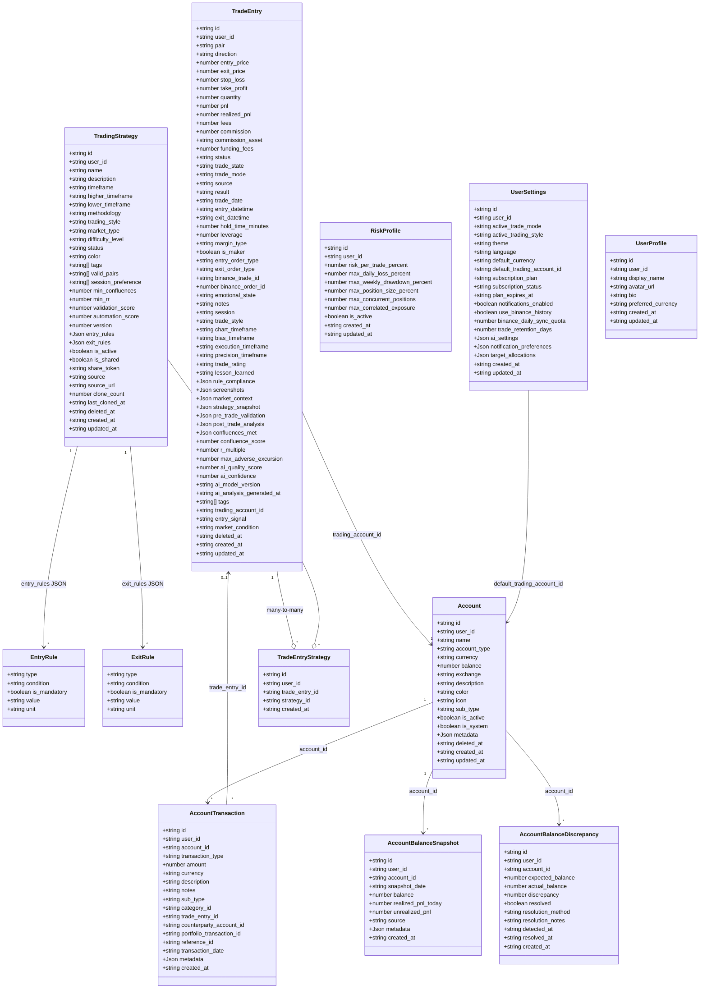
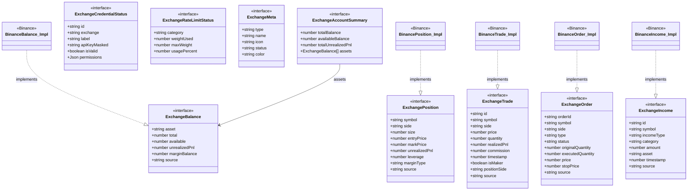

# Class Diagram — Trading Journal System

> **Version**: 1.0  
> **Last Updated**: 2026-02-13  
> **Coverage**: 60+ classes/interfaces across 5 diagrams  
> **Modules**: Trading Journal, Trade History, Import Trades

---

## Table of Contents

1. [Core Domain Entities](#1-core-domain-entities)
2. [Trade Wizard & AI System](#2-trade-wizard--ai-system)
3. [Binance Integration & Sync Engine](#3-binance-integration--sync-engine)
4. [Exchange Abstraction Layer](#4-exchange-abstraction-layer)
5. [Solana Import & Trade History](#5-solana-import--trade-history)

---

## 1. Core Domain Entities

Primary data models persisted in the database and used across all modules.

---

## 2. Trade Wizard & AI System

Wizard state management, pre-trade validation, position sizing, market context, and AI intelligence types.

```mermaid
classDiagram
    class WizardState {
        +number currentStep
        +number[] completedSteps
        +string mode
        +PreValidationResult preValidation
        +TradingStrategy strategyDetails
        +TradeDetailsData tradeDetails
        +UnifiedMarketContext marketContext
        +ConfluenceData confluences
        +TradePriceLevels priceLevels
        +PositionSizeResult positionSizing
        +FinalChecklistData finalChecklist
        +string tradingAccountId
        +number accountBalance
    }

    class TradeDetailsData {
        +string pair
        +string direction
        +string timeframe
    }

    class TradePriceLevels {
        +number entryPrice
        +number stopLoss
        +number takeProfit
    }

    class ConfluenceData {
        +string[] checkedItems
        +number totalRequired
        +boolean passed
        +number aiConfidence
    }

    class FinalChecklistData {
        +string emotionalState
        +number confidenceLevel
        +boolean followingRules
        +string tradeComment
        +number aiQualityScore
    }

    class PreValidationResult {
        +ValidationCheck dailyLossCheck
        +ValidationCheck positionLimitCheck
        +ValidationCheck correlationCheck
        +boolean canProceed
        +string overallStatus
    }

    class ValidationCheck {
        +boolean passed
        +string message
        +string severity
    }

    class PositionSizeResult {
        +number position_size
        +number position_value
        +number risk_amount
        +number capital_deployment_percent
        +string[] warnings
        +number potential_profit_1r
        +number potential_profit_2r
        +number potential_profit_3r
    }

    class UnifiedMarketContext {
        +MarketSentimentContext sentiment
        +FearGreedContext fearGreed
        +VolatilityContext volatility
        +EventContext events
        +MomentumContext momentum
        +SessionContext session
        +number compositeScore
        +string tradingBias
    }

    class MarketSentimentContext {
        +number longShortRatio
        +number topTraderLongShort
        +number openInterestChange
        +number takerBuySellRatio
        +string bias
        +number score
    }

    class FearGreedContext {
        +number index
        +string classification
        +string bias
        +number score
    }

    class VolatilityContext {
        +number atr14
        +number atrPercent
        +string regime
        +string bias
        +number score
    }

    class EventContext {
        +boolean hasHighImpact
        +string[] upcomingEvents
        +string bias
        +number score
    }

    class MomentumContext {
        +number rsi14
        +string macdSignal
        +string trendDirection
        +string bias
        +number score
    }

    class SessionContext {
        +string currentSession
        +string[] activeSessions
        +number liquidityScore
        +string bias
        +number score
    }

    class PreflightInput {
        +string pair
        +string direction
        +string timeframe
        +number entryPrice
        +number stopLoss
        +number takeProfit
        +string strategyName
        +UnifiedMarketContext marketContext
        +ConfluenceData confluences
    }

    class PreflightResponse {
        +string verdict
        +number confidence
        +number expectancy
        +number edgeStrength
        +PreflightLayer[] layers
    }

    class PreflightLayer {
        +string name
        +string status
        +number score
        +string detail
    }

    class AIConfluenceResult {
        +number confidence
        +string[] strengths
        +string[] weaknesses
        +string recommendation
    }

    class AITradeQualityScore {
        +number overall
        +number entryTiming
        +number riskManagement
        +number confluenceStrength
        +string[] feedback
    }

    class AIPatternInsight {
        +string pattern
        +number confidence
        +string timeframe
        +string implication
    }

    class PostTradeAnalysis {
        +string overallAssessment
        +number entryTimingScore
        +number exitEfficiencyScore
        +number slPlacementScore
        +number strategyAdherenceScore
        +string[] whatWorked
        +string[] toImprove
        +string[] followUpActions
        +string[] winFactors
        +string[] lossFactors
        +string[] lessons
    }

    class PreTradeValidation {
        +string verdict
        +number confidence
        +string[] warnings
        +string[] suggestions
    }

    class TradingGateState {
        +boolean canTrade
        +string status
        +number lossUsedPercent
        +number remainingBudget
        +boolean aiQualityWarning
        +boolean aiQualityBlocked
    }

    WizardState --> PreValidationResult
    WizardState --> TradeDetailsData
    WizardState --> TradePriceLevels
    WizardState --> ConfluenceData
    WizardState --> FinalChecklistData
    WizardState --> PositionSizeResult
    WizardState --> UnifiedMarketContext
    PreValidationResult --> ValidationCheck
    UnifiedMarketContext --> MarketSentimentContext
    UnifiedMarketContext --> FearGreedContext
    UnifiedMarketContext --> VolatilityContext
    UnifiedMarketContext --> EventContext
    UnifiedMarketContext --> MomentumContext
    UnifiedMarketContext --> SessionContext
    PreflightInput --> UnifiedMarketContext
    PreflightInput --> ConfluenceData
    PreflightResponse --> PreflightLayer
```

---

## 3. Binance Integration & Sync Engine

Raw Binance API types, position lifecycle grouping, aggregation pipeline, and sync state management.

```mermaid
classDiagram
    class TradeState {
        <<enumeration>>
        OPENING
        PARTIALLY_FILLED
        ACTIVE
        CLOSED
        CANCELED
        LIQUIDATED
    }

    class BinanceTrade {
        +number id
        +string symbol
        +number orderId
        +string side
        +number price
        +number qty
        +number quoteQty
        +number realizedPnl
        +number commission
        +string commissionAsset
        +string positionSide
        +boolean maker
        +boolean buyer
        +number time
    }

    class BinanceOrder {
        +number orderId
        +string symbol
        +string status
        +string type
        +string side
        +string positionSide
        +number price
        +number avgPrice
        +number origQty
        +number executedQty
        +number stopPrice
        +string workingType
        +boolean closePosition
        +number time
        +number updateTime
    }

    class BinancePosition {
        +string symbol
        +number positionAmt
        +number entryPrice
        +number markPrice
        +number unrealizedProfit
        +number leverage
        +string marginType
        +number liquidationPrice
        +string positionSide
        +number notional
        +number maxNotionalValue
    }

    class BinanceBalance {
        +string asset
        +number balance
        +number availableBalance
        +number crossWalletBalance
        +number crossUnPnl
        +number maxWithdrawAmount
    }

    class BinanceAccountSummary {
        +number totalWalletBalance
        +number totalUnrealizedProfit
        +number totalMarginBalance
        +number availableBalance
        +number totalCrossWalletBalance
        +BinanceBalance[] assets
        +BinancePosition[] positions
    }

    class BinanceIncome {
        +string symbol
        +string incomeType
        +number income
        +string asset
        +string info
        +number time
        +number tranId
        +string tradeId
    }

    class BinanceCredentials {
        +string apiKey
        +string apiSecret
    }

    class BinanceConnectionStatus {
        +boolean isConnected
        +boolean isValid
        +string label
        +string apiKeyMasked
        +Json permissions
        +string lastValidatedAt
        +string validationError
    }

    class CommissionRate {
        +string symbol
        +number makerCommissionRate
        +number takerCommissionRate
    }

    class LeverageBracket {
        +number bracket
        +number initialLeverage
        +number notionalCap
        +number notionalFloor
        +number maintMarginRatio
    }

    class ForceOrder {
        +string symbol
        +number price
        +number origQty
        +number executedQty
        +number averagePrice
        +string status
        +string timeInForce
        +string type
        +string side
        +number time
    }

    class PositionMode {
        +boolean dualSidePosition
    }

    class AccountConfig {
        +number feeTier
        +boolean canTrade
        +boolean canDeposit
        +boolean canWithdraw
        +number updateTime
        +boolean multiAssetsMargin
        +number tradeGroupId
    }

    class AdlQuantile {
        +string symbol
        +number longQuantile
        +number shortQuantile
        +boolean isAutoAddMargin
    }

    class PositionLifecycle {
        +string symbol
        +string direction
        +string positionSide
        +BinanceTrade[] entryFills
        +BinanceTrade[] exitFills
        +BinanceOrder[] entryOrders
        +BinanceOrder[] exitOrders
        +BinanceIncome[] incomeRecords
        +number entryTime
        +number exitTime
        +boolean isComplete
        +string lifecycleId
    }

    class AggregatedTrade {
        +string binance_trade_id
        +number binance_order_id
        +string pair
        +string direction
        +number entry_price
        +number exit_price
        +number quantity
        +number realized_pnl
        +number commission
        +string commission_asset
        +number funding_fees
        +number fees
        +number pnl
        +Date entry_datetime
        +Date exit_datetime
        +Date trade_date
        +number hold_time_minutes
        +number leverage
        +string margin_type
        +boolean is_maker
        +string entry_order_type
        +string exit_order_type
        +number r_multiple
        +number max_adverse_excursion
        +string result
        +string status
        +TradeState trade_state
        +string source
        +ValidationResult _validation
        +PositionLifecycle _rawLifecycle
    }

    class ValidationResult {
        +boolean isValid
        +ValidationError[] errors
        +ValidationWarning[] warnings
        +CrossValidation crossValidation
    }

    class CrossValidation {
        +number calculatedPnl
        +number reportedPnl
        +number pnlDifference
        +number pnlDifferencePercent
    }

    class ValidationError {
        +string field
        +string message
        +string severity
    }

    class ValidationWarning {
        +string field
        +string message
        +string severity
    }

    class AggregationResult {
        +boolean success
        +AggregatedTrade[] trades
        +AggregationStats stats
        +AggregationFailure[] failures
        +Reconciliation reconciliation
        +PartialSuccess partialSuccess
    }

    class AggregationStats {
        +number totalLifecycles
        +number completeLifecycles
        +number incompleteLifecycles
        +number validTrades
        +number invalidTrades
        +number warningTrades
    }

    class AggregationFailure {
        +string lifecycleId
        +string reason
        +PositionLifecycle lifecycle
    }

    class Reconciliation {
        +number binanceTotalPnl
        +number aggregatedTotalPnl
        +number matchedIncomePnl
        +number unmatchedIncomePnl
        +number difference
        +number differencePercent
        +boolean isReconciled
        +string incompletePositionsNote
    }

    class PartialSuccess {
        +number insertedCount
        +BatchFailure[] failedBatches
        +SymbolFailure[] failedSymbols
        +number skippedDueToError
    }

    class SyncCheckpoint {
        +string currentPhase
        +BinanceIncome[] incomeData
        +Record tradesBySymbol
        +Record ordersBySymbol
        +string[] processedSymbols
        +SymbolFailure[] failedSymbols
        +string[] allSymbols
        +number syncStartTime
        +number syncRangeDays
        +number lastCheckpointTime
        +TimeRange timeRange
    }

    class SyncQuotaInfo {
        +number currentCount
        +number maxQuota
        +number remaining
        +number usagePercent
        +boolean isExhausted
    }

    class AggregationProgress {
        +string phase
        +number current
        +number total
        +string message
    }

    class RawBinanceData {
        +BinanceTrade[] trades
        +BinanceOrder[] orders
        +BinanceIncome[] income
        +Date fetchedAt
        +number periodStart
        +number periodEnd
        +string[] symbols
    }

    class GroupedIncome {
        +BinanceIncome[] realizedPnl
        +BinanceIncome[] commission
        +BinanceIncome[] fundingFee
        +BinanceIncome[] other
    }

    PositionLifecycle --> BinanceTrade : entryFills / exitFills
    PositionLifecycle --> BinanceOrder : entryOrders / exitOrders
    PositionLifecycle --> BinanceIncome : incomeRecords
    AggregatedTrade --> PositionLifecycle : _rawLifecycle
    AggregatedTrade --> ValidationResult : _validation
    AggregatedTrade --> TradeState : trade_state
    ValidationResult --> ValidationError
    ValidationResult --> ValidationWarning
    ValidationResult --> CrossValidation
    AggregationResult --> AggregatedTrade : trades
    AggregationResult --> AggregationStats : stats
    AggregationResult --> AggregationFailure : failures
    AggregationResult --> Reconciliation : reconciliation
    AggregationResult --> PartialSuccess : partialSuccess
    AggregationFailure --> PositionLifecycle
    BinanceAccountSummary --> BinanceBalance : assets
    BinanceAccountSummary --> BinancePosition : positions
    RawBinanceData --> BinanceTrade
    RawBinanceData --> BinanceOrder
    RawBinanceData --> BinanceIncome
    GroupedIncome --> BinanceIncome
    SyncCheckpoint --> BinanceIncome : incomeData
```

---

## 4. Exchange Abstraction Layer

Generic exchange interfaces for multi-exchange readiness. Binance types implement these interfaces.

---

## 5. Solana Import & Trade History

On-chain import pipeline, trade history filtering, enrichment, and risk management types.

```mermaid
classDiagram
    class ImportStatus {
        <<enumeration>>
        idle
        fetching
        parsed
        importing
        done
        error
    }

    class ParsedSolanaTrade {
        +string signature
        +number blockTime
        +string program
        +string programName
        +string direction
        +string pair
        +number entryPrice
        +number exitPrice
        +number quantity
        +number pnl
        +number fees
        +string status
    }

    class SolanaParserResult {
        +ParsedSolanaTrade[] trades
        +number totalTransactions
        +number parsedCount
        +string[] errors
    }

    class SolanaTradeImportState {
        +ImportStatus status
        +SolanaParserResult result
        +ParsedSolanaTrade[] selectedTrades
        +number importedCount
        +string errorMessage
        +string walletAddress
    }

    class TradeHistoryFiltersState {
        +DateRange dateRange
        +string resultFilter
        +string directionFilter
        +string sessionFilter
        +string[] selectedStrategyIds
        +string[] selectedPairs
        +boolean sortByAI
        +boolean showFullHistory
    }

    class DateRange {
        +Date from
        +Date to
    }

    class TradeStats {
        +number totalTrades
        +number totalPnlGross
        +number totalPnlNet
        +number totalFees
        +number totalCommission
        +number totalFundingFees
        +number winCount
        +number lossCount
        +number breakevenCount
        +number winRate
        +number avgWin
        +number avgLoss
        +number avgPnlPerTrade
        +number profitFactor
    }

    class EnrichmentData {
        +string notes
        +string emotionalState
        +string chartTimeframe
        +string[] customTags
        +Json screenshots
        +string[] selectedStrategies
        +string biasTimeframe
        +string executionTimeframe
        +string precisionTimeframe
        +string tradeRating
        +string lessonLearned
        +Json ruleCompliance
    }

    class TradeModeState {
        +string tradeMode
        +string tradingStyle
        +boolean isPaper
        +boolean isLive
    }

    class DailyRiskSnapshot {
        +string id
        +string user_id
        +string snapshot_date
        +number starting_balance
        +number current_pnl
        +number loss_limit_used_percent
        +number capital_deployed_percent
        +number positions_open
        +boolean trading_allowed
        +string created_at
    }

    class DailyRiskStatus {
        +boolean canTrade
        +string status
        +number lossUsedPercent
        +number remainingBudget
        +number positionsOpen
        +number maxPositions
    }

    class ClosePositionInput {
        +string id
        +number exit_price
        +number pnl
        +number fees
        +string notes
    }

    class RiskEvent {
        +string id
        +string user_id
        +string event_type
        +string event_date
        +string message
        +number threshold_value
        +number trigger_value
        +Json metadata
        +string created_at
    }

    class Notification {
        +string id
        +string user_id
        +string title
        +string message
        +string type
        +string asset_symbol
        +boolean read
        +Json metadata
        +string created_at
    }

    class BacktestResult {
        +string id
        +string user_id
        +string strategy_id
        +string pair
        +string period_start
        +string period_end
        +number initial_capital
        +number final_capital
        +Json metrics
        +Json trades
        +Json equity_curve
        +Json assumptions
        +string accuracy_notes
        +string simulation_version
        +string created_at
    }

    class ExchangeCredential {
        +string id
        +string user_id
        +string exchange
        +string label
        +string api_key_encrypted
        +string api_secret_encrypted
        +boolean is_active
        +boolean is_valid
        +Json permissions
        +string last_validated_at
        +string validation_error
        +string created_at
        +string updated_at
    }

    class ApiRateLimit {
        +string id
        +string user_id
        +string exchange
        +string endpoint_category
        +number weight_used
        +string window_start
        +string window_end
        +string last_request_at
        +string created_at
    }

    class SyncQuotaUsage {
        +string id
        +string user_id
        +string sync_date
        +number sync_count
        +string last_sync_at
        +string created_at
    }

    class TradingPair {
        +string id
        +string symbol
        +string base_asset
        +string quote_asset
        +boolean is_active
        +string source
        +string last_synced_at
        +string created_at
    }

    class FeaturePermission {
        +string id
        +string feature_key
        +string feature_name
        +string description
        +string min_subscription
        +boolean admin_only
        +string created_at
    }

    class UserRole {
        +string id
        +string user_id
        +string role
        +string created_at
        +string updated_at
    }

    SolanaParserResult --> ParsedSolanaTrade : trades
    SolanaTradeImportState --> ImportStatus : status
    SolanaTradeImportState --> SolanaParserResult : result
    SolanaTradeImportState --> ParsedSolanaTrade : selectedTrades
    TradeHistoryFiltersState --> DateRange : dateRange
    TradeHistoryFiltersState ..> TradeStats : filters applied to
    EnrichmentData ..> TradeEntry : enriches
    DailyRiskStatus ..> DailyRiskSnapshot : derived from
    ClosePositionInput ..> TradeEntry : closes
    BacktestResult --> TradingStrategy : strategy_id
    RiskEvent ..> DailyRiskSnapshot : triggers from
```

---

## Cross-Diagram Relationships

| From | To | Relationship | Notes |
|---|---|---|---|
| `AggregatedTrade` | `TradeEntry` | Maps to DB insert | Aggregation pipeline output → trade_entries table |
| `ParsedSolanaTrade` | `TradeEntry` | Maps to DB insert | Import pipeline output → trade_entries table |
| `WizardState` | `TradeEntry` | Creates | Wizard submission → trade_entries insert |
| `EnrichmentData` | `TradeEntry` | Updates | Drawer save → trade_entries update |
| `ClosePositionInput` | `TradeEntry` | Updates | Close action → trade_entries update |
| `BinancePosition` | `ExchangePosition` | Implements | Via exchange-mappers.ts |
| `BinanceTrade` | `ExchangeTrade` | Implements | Via exchange-mappers.ts |
| `TradingGateState` | `DailyRiskSnapshot` | Derived from | Risk engine computes gate |
| `PreflightResponse` | `WizardState` | Blocks/allows | AI pre-flight verdict |
| `SyncCheckpoint` | `AggregationResult` | Produces | Sync engine checkpoint → aggregation |
| `TradeStats` | `TradeEntry` | Aggregates | RPC get_trade_stats → server-side stats |
| `BacktestResult` | `TradingStrategy` | References | Backtest runs against strategy |

---

## Legend

| Symbol | Meaning |
|---|---|
| `-->` | Association (directed) |
| `--o` | Aggregation |
| `--|>` | Inheritance |
| `..\|>` | Implementation |
| `..>` | Dependency |
| `+` | Public |
| `-` | Private |
| `#` | Protected |
| `<<interface>>` | Interface stereotype |
| `<<enumeration>>` | Enum stereotype |
