# Complete Database & Edge Functions Analysis

> **Last Updated**: 2026-02-01  
> **Document Status**: Complete Technical Documentation  
> **Purpose**: Single Source of Truth untuk Database & Backend Architecture

---

## Table of Contents

1. [High-Level System Overview](#1-high-level-system-overview)
2. [Database Philosophy & Design Principles](#2-database-philosophy--design-principles)
3. [Domain-to-Database Mapping](#3-domain-to-database-mapping)
4. [Detailed Table Documentation](#4-detailed-table-documentation)
5. [Data Flow & Lifecycle](#5-data-flow--lifecycle)
6. [Edge Functions Overview](#6-edge-functions-overview)
7. [Database ↔ Edge Function Interaction](#7-database--edge-function-interaction)
8. [Derived Data & Calculation Strategy](#8-derived-data--calculation-strategy)
9. [Data Integrity & Consistency Rules](#9-data-integrity--consistency-rules)
10. [Performance & Scalability Considerations](#10-performance--scalability-considerations)
11. [Security & Access Control](#11-security--access-control)
12. [Known Gaps & TODO](#12-known-gaps--todo)

---

## 1. High-Level System Overview

### System Components

| Component | Role | Technology |
|-----------|------|------------|
| **Frontend** | UI, user interaction, local state | React + Vite + TypeScript |
| **Database** | Persistent storage, RLS, triggers | PostgreSQL (Supabase) |
| **Edge Functions** | API proxy, AI processing, aggregation | Deno (Supabase Edge Functions) |
| **External APIs** | Market data, sentiment, economic events | Binance, CoinGecko, Alternative.me |

### System Architecture Diagram

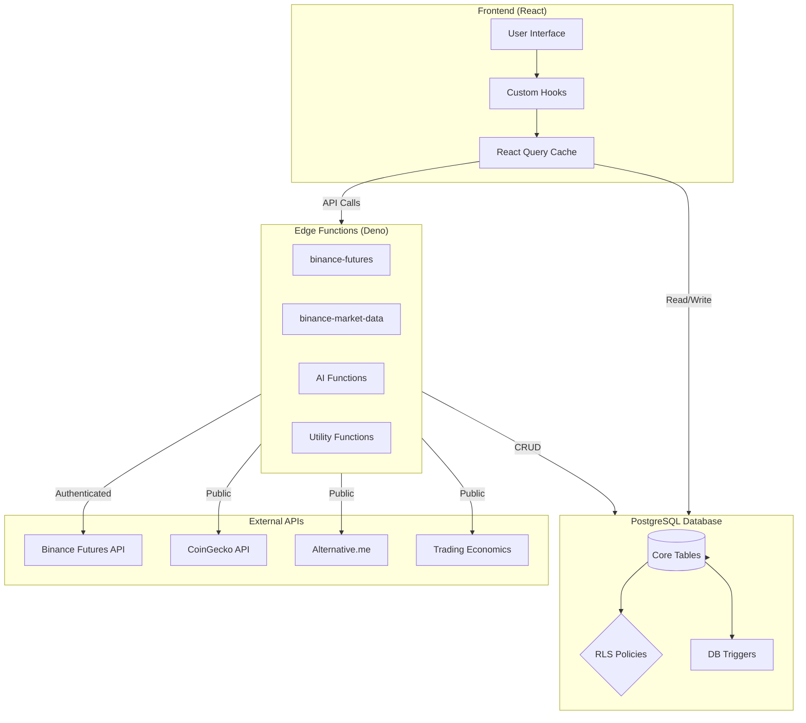
```mermaid
flowchart TB
    subgraph Frontend["Frontend (React)"]
        UI[User Interface]
        Hooks[Custom Hooks]
        Cache[React Query Cache]
    end

    subgraph EdgeFunctions["Edge Functions (Deno)"]
        BinanceFutures[binance-futures]
        BinanceMarket[binance-market-data]
        AIFunctions[AI Functions]
        Utilities[Utility Functions]
    end

    subgraph Database["PostgreSQL Database"]
        CoreTables[(Core Tables)]
        RLS{RLS Policies}
        Triggers[DB Triggers]
    end

    subgraph External["External APIs"]
        BinanceAPI[Binance Futures API]
        CoinGecko[CoinGecko API]
        Alternative[Alternative.me]
        TradingEcon[Trading Economics]
    end

    UI --> Hooks
    Hooks --> Cache
    Cache --> |Read/Write| Database
    Cache --> |API Calls| EdgeFunctions
    
    EdgeFunctions --> |Authenticated| BinanceAPI
    EdgeFunctions --> |Public| CoinGecko
    EdgeFunctions --> |Public| Alternative
    EdgeFunctions --> |Public| TradingEcon
    
    EdgeFunctions --> |CRUD| Database
    
    Database --> CoreTables
    CoreTables --> RLS
    CoreTables --> Triggers
```

### Data Flow Summary

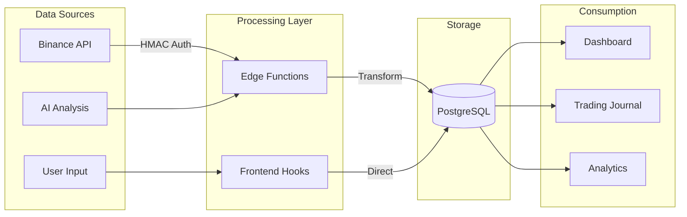
```mermaid
flowchart LR
    subgraph Sources["Data Sources"]
        Binance[Binance API]
        User[User Input]
        AI[AI Analysis]
    end

    subgraph Processing["Processing Layer"]
        Edge[Edge Functions]
        Frontend[Frontend Hooks]
    end

    subgraph Storage["Storage"]
        DB[(PostgreSQL)]
    end

    subgraph Consumption["Consumption"]
        Dashboard[Dashboard]
        Journal[Trading Journal]
        Analytics[Analytics]
    end

    Binance --> |HMAC Auth| Edge
    User --> Frontend
    AI --> Edge
    
    Edge --> |Transform| DB
    Frontend --> |Direct| DB
    
    DB --> Dashboard
    DB --> Journal
    DB --> Analytics
```

---

## 2. Database Philosophy & Design Principles

### Core Design Principles

| Principle | Description | Application |
|-----------|-------------|-------------|
| **Binance as Source of Truth** | Live trading data comes from Binance API | `trade_entries.source = 'binance'` |
| **User Ownership** | All data is scoped to individual users | RLS: `auth.uid() = user_id` |
| **Immutability for Trades** | Closed trades are mostly immutable | Only enrichment fields can be updated |
| **Append-Only for History** | Snapshots and events are never updated | `account_balance_snapshots`, `risk_events` |
| **Derived at Read Time** | Most aggregations are computed on query | Win rate, PnL totals, etc. |

### Data Categories

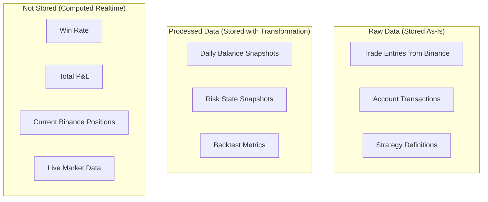
```mermaid
graph TD
    subgraph Raw["Raw Data (Stored As-Is)"]
        TradeData[Trade Entries from Binance]
        Transactions[Account Transactions]
        StrategyDef[Strategy Definitions]
    end

    subgraph Processed["Processed Data (Stored with Transformation)"]
        BalanceSnapshots[Daily Balance Snapshots]
        RiskSnapshots[Risk State Snapshots]
        BacktestResults[Backtest Metrics]
    end

    subgraph NotStored["Not Stored (Computed Realtime)"]
        WinRate[Win Rate]
        TotalPnL[Total P&L]
        CurrentPositions[Current Binance Positions]
        MarketData[Live Market Data]
    end
```

### What Gets Stored vs. What Doesn't

| Category | Stored | Not Stored | Reason |
|----------|--------|------------|--------|
| **Trade History** | ✅ `trade_entries` | - | Permanent audit trail |
| **Current Positions** | - | ✅ Live API | Positions change constantly |
| **Wallet Balance** | ✅ Snapshots | ✅ Live API | Need historical + current |
| **Market Prices** | - | ✅ Live API | Too volatile, no historical need |
| **Fear & Greed** | ✅ In `market_context` | - | Captured at trade time |
| **AI Analysis** | ✅ JSONB fields | - | Expensive to regenerate |

---

## 3. Domain-to-Database Mapping

### Domain Architecture

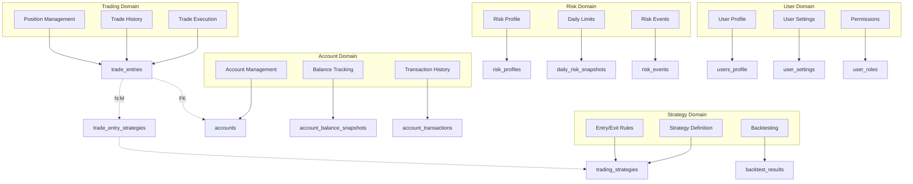
```mermaid
graph TB
    subgraph TradingDomain["Trading Domain"]
        TD1[Trade Execution]
        TD2[Trade History]
        TD3[Position Management]
    end

    subgraph AccountDomain["Account Domain"]
        AD1[Account Management]
        AD2[Balance Tracking]
        AD3[Transaction History]
    end

    subgraph StrategyDomain["Strategy Domain"]
        SD1[Strategy Definition]
        SD2[Entry/Exit Rules]
        SD3[Backtesting]
    end

    subgraph RiskDomain["Risk Domain"]
        RD1[Risk Profile]
        RD2[Daily Limits]
        RD3[Risk Events]
    end

    subgraph UserDomain["User Domain"]
        UD1[User Profile]
        UD2[User Settings]
        UD3[Permissions]
    end

    TD1 --> trade_entries
    TD2 --> trade_entries
    TD3 --> trade_entries

    AD1 --> accounts
    AD2 --> account_balance_snapshots
    AD3 --> account_transactions

    SD1 --> trading_strategies
    SD2 --> trading_strategies
    SD3 --> backtest_results

    RD1 --> risk_profiles
    RD2 --> daily_risk_snapshots
    RD3 --> risk_events

    UD1 --> users_profile
    UD2 --> user_settings
    UD3 --> user_roles

    trade_entries -.-> |N:M| trade_entry_strategies
    trade_entry_strategies -.-> trading_strategies
    trade_entries -.-> |FK| accounts
```

### Domain Responsibilities

| Domain | Primary Table(s) | Responsibility | Boundary |
|--------|------------------|----------------|----------|
| **Trading** | `trade_entries`, `trade_entry_strategies` | Individual trade records, enrichment | Does NOT manage money |
| **Account** | `accounts`, `account_transactions`, `account_balance_snapshots` | Financial tracking, deposits/withdrawals | Does NOT execute trades |
| **Strategy** | `trading_strategies`, `backtest_results` | Strategy definitions, performance testing | Does NOT store live trades |
| **Risk** | `risk_profiles`, `daily_risk_snapshots`, `risk_events` | Risk parameters, monitoring | Does NOT enforce limits (advisory only) |
| **User** | `users_profile`, `user_settings`, `user_roles` | Identity, preferences, permissions | Does NOT store trading data |

---

## 4. Detailed Table Documentation

### 4.1 Trading Domain Tables

#### Entity Relationship

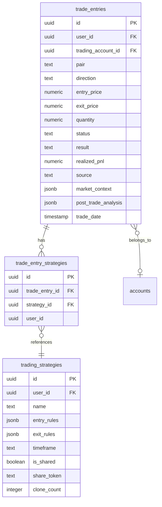
```mermaid
erDiagram
    trade_entries ||--o{ trade_entry_strategies : "has"
    trade_entry_strategies }o--|| trading_strategies : "references"
    trade_entries }o--o| accounts : "belongs_to"
    
    trade_entries {
        uuid id PK
        uuid user_id FK
        uuid trading_account_id FK
        text pair
        text direction
        numeric entry_price
        numeric exit_price
        numeric quantity
        text status
        text result
        numeric realized_pnl
        text source
        jsonb market_context
        jsonb post_trade_analysis
        timestamp trade_date
    }
    
    trade_entry_strategies {
        uuid id PK
        uuid trade_entry_id FK
        uuid strategy_id FK
        uuid user_id
    }
    
    trading_strategies {
        uuid id PK
        uuid user_id FK
        text name
        jsonb entry_rules
        jsonb exit_rules
        text timeframe
        boolean is_shared
        text share_token
        integer clone_count
    }
```

#### `trade_entries` Table

**Purpose**: Records every trade (open, closed, manual, synced from Binance).

| Column | Type | Nullable | Default | Business Meaning | Example |
|--------|------|----------|---------|------------------|---------|
| `id` | UUID | No | `gen_random_uuid()` | Unique trade identifier | `a1b2c3d4-...` |
| `user_id` | UUID | No | - | Owner of this trade | `user-uuid` |
| `pair` | TEXT | No | - | Trading pair symbol | `BTCUSDT` |
| `direction` | TEXT | No | - | LONG or SHORT | `LONG` |
| `entry_price` | NUMERIC | No | - | Entry execution price | `42500.50` |
| `exit_price` | NUMERIC | Yes | - | Exit execution price | `43200.00` |
| `quantity` | NUMERIC | No | `1` | Position size in base asset | `0.05` |
| `status` | TEXT | No | `'closed'` | Trade state: pending/open/closed | `closed` |
| `result` | TEXT | Yes | - | Win/Loss/Breakeven | `win` |
| `realized_pnl` | NUMERIC | Yes | `0` | Net profit/loss | `35.25` |
| `source` | TEXT | Yes | `'manual'` | Origin: binance/paper/manual | `binance` |
| `binance_trade_id` | TEXT | Yes | - | Binance transaction ID | `123456789` |
| `binance_order_id` | BIGINT | Yes | - | Binance order ID | `987654321` |
| `trading_account_id` | UUID | Yes | - | Link to accounts table | `account-uuid` |
| `trade_date` | TIMESTAMPTZ | No | `now()` | Primary trade timestamp | `2026-01-15T10:30:00Z` |
| `entry_datetime` | TIMESTAMPTZ | Yes | - | Exact entry time | `2026-01-15T10:30:00Z` |
| `exit_datetime` | TIMESTAMPTZ | Yes | - | Exact exit time | `2026-01-15T14:45:00Z` |
| `stop_loss` | NUMERIC | Yes | - | Stop loss price | `41000.00` |
| `take_profit` | NUMERIC | Yes | - | Take profit price | `44000.00` |
| `commission` | NUMERIC | Yes | `0` | Trading fees | `2.50` |
| `commission_asset` | TEXT | Yes | - | Fee currency | `USDT` |
| `market_context` | JSONB | Yes | - | Captured market state | `{"fearGreed": 45, "btcDominance": 52}` |
| `post_trade_analysis` | JSONB | Yes | - | AI-generated analysis | `{"lessons": [...], "improvements": [...]}` |
| `ai_quality_score` | NUMERIC | Yes | - | AI trade quality (0-100) | `78` |
| `confluence_score` | INTEGER | Yes | - | Confluences met count | `4` |
| `emotional_state` | TEXT | Yes | - | Trader's state at entry | `calm` |
| `notes` | TEXT | Yes | - | Free-form notes | `Strong support bounce` |
| `tags` | TEXT[] | Yes | - | Categorization tags | `['breakout', 'high-volume']` |
| `screenshots` | JSONB | Yes | `'[]'` | Chart screenshots (max 3) | `[{"path": "...", "caption": "..."}]` |

**Data Lifecycle**:
- **Created**: On trade sync from Binance, manual entry, or paper trade
- **Updated**: When trade closes, on enrichment, on AI analysis
- **Immutable Fields**: `pair`, `direction`, `entry_price`, `source`, `binance_trade_id`
- **Deletable**: Yes (user can delete their own trades)

#### `trading_strategies` Table

**Purpose**: Stores user-defined trading strategies with rules and metadata.

| Column | Type | Nullable | Default | Business Meaning | Example |
|--------|------|----------|---------|------------------|---------|
| `id` | UUID | No | `gen_random_uuid()` | Strategy identifier | `strat-uuid` |
| `user_id` | UUID | No | - | Strategy owner | `user-uuid` |
| `name` | TEXT | No | - | Strategy name | `Breakout Scalper` |
| `description` | TEXT | Yes | - | Strategy description | `High volume breakout...` |
| `entry_rules` | JSONB | Yes | `'[]'` | Entry conditions | `[{"type": "indicator", ...}]` |
| `exit_rules` | JSONB | Yes | `'[]'` | Exit conditions | `[{"type": "take_profit", ...}]` |
| `timeframe` | TEXT | Yes | - | Primary timeframe | `1h` |
| `min_confluences` | INTEGER | Yes | `4` | Required confluences | `3` |
| `min_rr` | NUMERIC | Yes | `1.5` | Minimum R:R ratio | `2.0` |
| `is_shared` | BOOLEAN | Yes | `false` | Publicly shareable | `true` |
| `share_token` | TEXT | Yes | - | Unique share link token | `a1b2c3d4e5f6` |
| `clone_count` | INTEGER | Yes | `0` | Times cloned by others | `15` |
| `source` | TEXT | Yes | `'manual'` | Origin: manual/youtube | `youtube` |
| `source_url` | TEXT | Yes | - | YouTube video URL | `https://youtube.com/...` |
| `validation_score` | INTEGER | Yes | `100` | Completeness score | `85` |
| `automation_score` | INTEGER | Yes | `0` | Automation potential | `60` |

**Data Lifecycle**:
- **Created**: Manual creation or YouTube import
- **Updated**: Rule modifications, sharing toggle, clone count increments
- **Deletable**: Yes (cascades to trade_entry_strategies junction)

### 4.2 Account Domain Tables

#### Entity Relationship

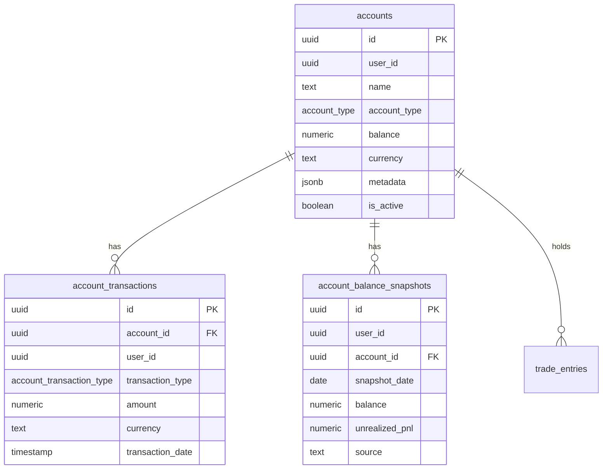
```mermaid
erDiagram
    accounts ||--o{ account_transactions : "has"
    accounts ||--o{ account_balance_snapshots : "has"
    accounts ||--o{ trade_entries : "holds"
    
    accounts {
        uuid id PK
        uuid user_id
        text name
        account_type account_type
        numeric balance
        text currency
        jsonb metadata
        boolean is_active
    }
    
    account_transactions {
        uuid id PK
        uuid account_id FK
        uuid user_id
        account_transaction_type transaction_type
        numeric amount
        text currency
        timestamp transaction_date
    }
    
    account_balance_snapshots {
        uuid id PK
        uuid user_id
        uuid account_id FK
        date snapshot_date
        numeric balance
        numeric unrealized_pnl
        text source
    }
```

#### `accounts` Table

**Purpose**: Represents trading accounts (Binance Real, Paper Trading).

| Column | Type | Nullable | Default | Business Meaning | Example |
|--------|------|----------|---------|------------------|---------|
| `id` | UUID | No | `gen_random_uuid()` | Account identifier | `acc-uuid` |
| `user_id` | UUID | No | - | Account owner | `user-uuid` |
| `name` | TEXT | No | - | Display name | `Binance Main` |
| `account_type` | ENUM | No | - | Type: trading/broker | `trading` |
| `balance` | NUMERIC | No | `0` | Current balance | `5000.00` |
| `currency` | TEXT | No | `'IDR'` | Base currency | `USD` |
| `is_active` | BOOLEAN | No | `true` | Active status | `true` |
| `metadata` | JSONB | Yes | `'{}'` | Extra config | `{"is_backtest": true}` |

**Metadata Schema for Paper Trading**:
```json
{
  "is_backtest": true,
  "initial_balance": 10000
}
```

**Data Lifecycle**:
- **Created**: User creates account (manual)
- **Updated**: Balance changes via triggers, user edits
- **Deletable**: Yes (soft-delete preferred)

#### `account_transactions` Table

**Purpose**: Records deposits, withdrawals for account balance tracking.

| Column | Type | Nullable | Default | Business Meaning | Example |
|--------|------|----------|---------|------------------|---------|
| `id` | UUID | No | `gen_random_uuid()` | Transaction ID | `tx-uuid` |
| `account_id` | UUID | No | - | Target account | `acc-uuid` |
| `user_id` | UUID | No | - | Owner | `user-uuid` |
| `transaction_type` | ENUM | No | - | deposit/withdrawal | `deposit` |
| `amount` | NUMERIC | No | - | Transaction amount | `500.00` |
| `currency` | TEXT | No | - | Currency code | `USD` |
| `transaction_date` | TIMESTAMPTZ | Yes | `now()` | When occurred | `2026-01-15T10:00:00Z` |
| `description` | TEXT | Yes | - | Transaction note | `Initial deposit` |

**Data Lifecycle**:
- **Created**: User records deposit/withdrawal
- **Trigger**: `update_account_balance` automatically updates `accounts.balance`
- **Immutable**: Once created, should not be modified
- **Deletable**: No (preserve audit trail)

### 4.3 Risk Domain Tables

#### Entity Relationship

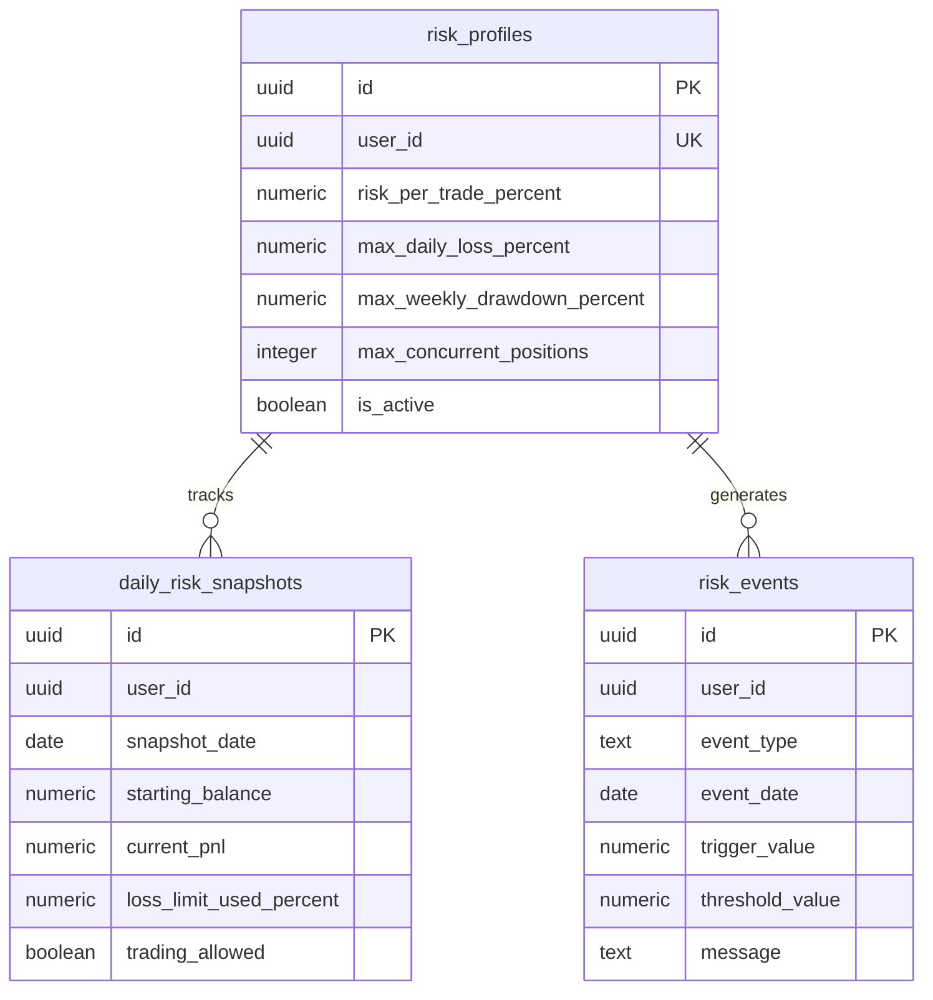
```mermaid
erDiagram
    risk_profiles ||--o{ daily_risk_snapshots : "tracks"
    risk_profiles ||--o{ risk_events : "generates"
    
    risk_profiles {
        uuid id PK
        uuid user_id UK
        numeric risk_per_trade_percent
        numeric max_daily_loss_percent
        numeric max_weekly_drawdown_percent
        integer max_concurrent_positions
        boolean is_active
    }
    
    daily_risk_snapshots {
        uuid id PK
        uuid user_id
        date snapshot_date
        numeric starting_balance
        numeric current_pnl
        numeric loss_limit_used_percent
        boolean trading_allowed
    }
    
    risk_events {
        uuid id PK
        uuid user_id
        text event_type
        date event_date
        numeric trigger_value
        numeric threshold_value
        text message
    }
```

#### `risk_profiles` Table

**Purpose**: User's risk management parameters.

| Column | Type | Nullable | Default | Business Meaning | Example |
|--------|------|----------|---------|------------------|---------|
| `user_id` | UUID | No | - | Owner (UNIQUE) | `user-uuid` |
| `risk_per_trade_percent` | NUMERIC | Yes | `2.0` | Max risk per trade | `2.0` |
| `max_daily_loss_percent` | NUMERIC | Yes | `5.0` | Daily loss limit | `5.0` |
| `max_weekly_drawdown_percent` | NUMERIC | Yes | `10.0` | Weekly drawdown limit | `10.0` |
| `max_concurrent_positions` | INTEGER | Yes | `3` | Max open positions | `3` |
| `is_active` | BOOLEAN | Yes | `true` | Profile active | `true` |

**Data Lifecycle**:
- **Created**: On first user configuration
- **Updated**: User modifies risk parameters
- **1:1 Relationship**: One profile per user

#### `risk_events` Table

**Purpose**: Audit trail of risk limit triggers.

| Column | Type | Nullable | Default | Business Meaning | Example |
|--------|------|----------|---------|------------------|---------|
| `event_type` | TEXT | No | - | Event category | `warning_70` |
| `trigger_value` | NUMERIC | No | - | Actual value at trigger | `3.5` |
| `threshold_value` | NUMERIC | No | - | Configured limit | `5.0` |
| `message` | TEXT | No | - | Human-readable message | `70% of daily loss limit reached` |

**Event Types**:
- `warning_70`: 70% of limit reached
- `warning_90`: 90% of limit reached
- `limit_reached`: 100% of limit
- `trading_disabled`: Auto-disabled trading
- `trading_enabled`: Trading re-enabled

**Data Lifecycle**:
- **Created**: When risk threshold is crossed
- **Immutable**: Never updated
- **Append-Only**: For audit compliance

### 4.4 User Domain Tables

#### Entity Relationship

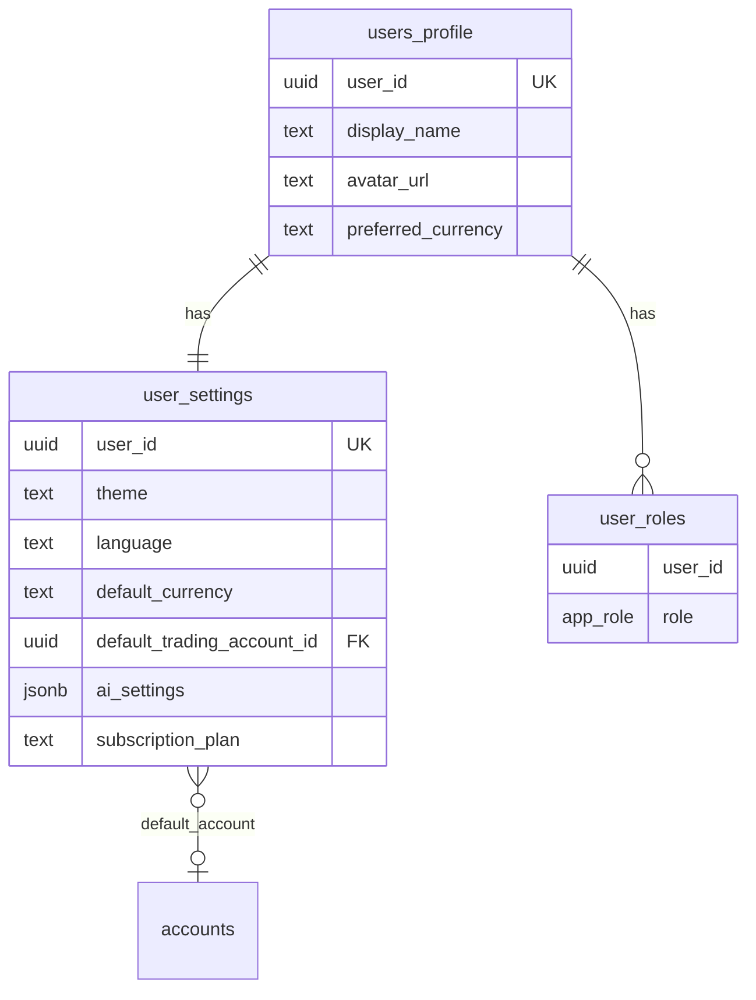
```mermaid
erDiagram
    users_profile ||--|| user_settings : "has"
    users_profile ||--o{ user_roles : "has"
    user_settings }o--o| accounts : "default_account"
    
    users_profile {
        uuid user_id UK
        text display_name
        text avatar_url
        text preferred_currency
    }
    
    user_settings {
        uuid user_id UK
        text theme
        text language
        text default_currency
        uuid default_trading_account_id FK
        jsonb ai_settings
        text subscription_plan
    }
    
    user_roles {
        uuid user_id
        app_role role
    }
```

#### `user_settings` Table

**Purpose**: All user preferences and configuration.

| Column | Type | Nullable | Default | Business Meaning | Example |
|--------|------|----------|---------|------------------|---------|
| `user_id` | UUID | No | - | Settings owner | `user-uuid` |
| `theme` | TEXT | No | `'system'` | UI theme | `dark` |
| `language` | TEXT | No | `'id'` | UI language | `id` |
| `default_currency` | TEXT | No | `'IDR'` | Display currency | `USD` |
| `default_trading_account_id` | UUID | Yes | - | Default account | `acc-uuid` |
| `subscription_plan` | TEXT | No | `'free'` | Subscription tier | `pro` |
| `ai_settings` | JSONB | Yes | (complex default) | AI feature toggles | See below |

**AI Settings Schema**:
```json
{
  "quality_scoring": true,
  "risk_monitoring": true,
  "pattern_recognition": true,
  "post_trade_analysis": true,
  "confluence_detection": true,
  "confidence_threshold": 75,
  "suggestion_style": "balanced"
}
```

#### `exchange_credentials` Table

**Purpose**: Secure storage for per-user exchange API credentials.

| Column | Type | Nullable | Default | Business Meaning |
|--------|------|----------|---------|------------------|
| `id` | UUID | No | `gen_random_uuid()` | Primary key |
| `user_id` | UUID | No | - | Credential owner |
| `exchange` | TEXT | No | `'binance'` | Exchange identifier |
| `api_key_encrypted` | TEXT | No | - | API key (should be encrypted) |
| `api_secret_encrypted` | TEXT | No | - | API secret (should be encrypted) |
| `label` | TEXT | Yes | `'Main Account'` | User-friendly label |
| `permissions` | JSONB | Yes | `'[]'` | Detected API permissions |
| `is_active` | BOOLEAN | No | `true` | Whether credential is active |
| `is_valid` | BOOLEAN | Yes | `null` | Last validation result |
| `last_validated_at` | TIMESTAMPTZ | Yes | - | Last validation timestamp |
| `validation_error` | TEXT | Yes | - | Error message if invalid |

**Security Notes**:
- **Per-User Isolation**: Each user has their own credentials
- **RLS Enforced**: Users can only see/manage their own credentials
- **Multi-Exchange Ready**: `exchange` column allows future exchange support
- **Deactivation**: Old credentials are set `is_active = false` when updated

**Data Lifecycle**:
- **Created**: User saves API keys in Settings
- **Validated**: Edge function tests connection and updates `is_valid`
- **Used**: Edge function reads per request (per-user lookup)
- **Deleted**: User removes from Settings

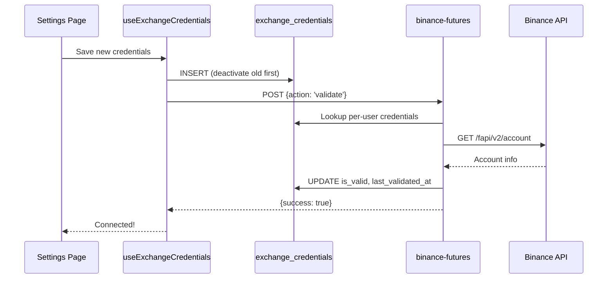
```mermaid
sequenceDiagram
    participant UI as Settings Page
    participant Hook as useExchangeCredentials
    participant DB as exchange_credentials
    participant EF as binance-futures
    participant Binance as Binance API

    UI->>Hook: Save new credentials
    Hook->>DB: INSERT (deactivate old first)
    Hook->>EF: POST {action: 'validate'}
    EF->>DB: Lookup per-user credentials
    EF->>Binance: GET /fapi/v2/account
    Binance-->>EF: Account info
    EF->>DB: UPDATE is_valid, last_validated_at
    EF-->>Hook: {success: true}
    Hook-->>UI: Connected!
```

### 4.5 Reference & Supporting Tables

#### `trading_pairs` Table

**Purpose**: Master list of tradable pairs from Binance.

| Column | Type | Nullable | Default | Business Meaning |
|--------|------|----------|---------|------------------|
| `symbol` | TEXT | No | - | Full symbol | `BTCUSDT` |
| `base_asset` | TEXT | No | - | Base currency | `BTC` |
| `quote_asset` | TEXT | No | - | Quote currency | `USDT` |
| `is_active` | BOOLEAN | Yes | `true` | Currently tradable |
| `source` | TEXT | Yes | `'binance_futures'` | Data source |
| `last_synced_at` | TIMESTAMPTZ | Yes | `now()` | Last sync time |

**Data Lifecycle**:
- **Synced**: Via `sync-trading-pairs` edge function
- **Public Read**: All authenticated users can read
- **No User Write**: System-managed only

#### `backtest_results` Table

**Purpose**: Stores historical backtest runs for strategies.

| Column | Type | Nullable | Default | Business Meaning |
|--------|------|----------|---------|------------------|
| `strategy_id` | UUID | Yes | - | Strategy tested |
| `pair` | TEXT | No | - | Tested pair |
| `period_start` | TIMESTAMPTZ | No | - | Backtest start date |
| `period_end` | TIMESTAMPTZ | No | - | Backtest end date |
| `initial_capital` | NUMERIC | No | `10000` | Starting capital |
| `final_capital` | NUMERIC | No | `10000` | Ending capital |
| `metrics` | JSONB | No | `'{}'` | Performance metrics |
| `trades` | JSONB | No | `'[]'` | Simulated trades |
| `equity_curve` | JSONB | No | `'[]'` | Equity over time |

**Metrics Schema**:
```json
{
  "totalReturn": 15.5,
  "winRate": 0.62,
  "profitFactor": 1.85,
  "maxDrawdown": 8.2,
  "sharpeRatio": 1.45,
  "totalTrades": 48
}
```

---

## 5. Data Flow & Lifecycle

### 5.1 Binance Trade Sync Flow

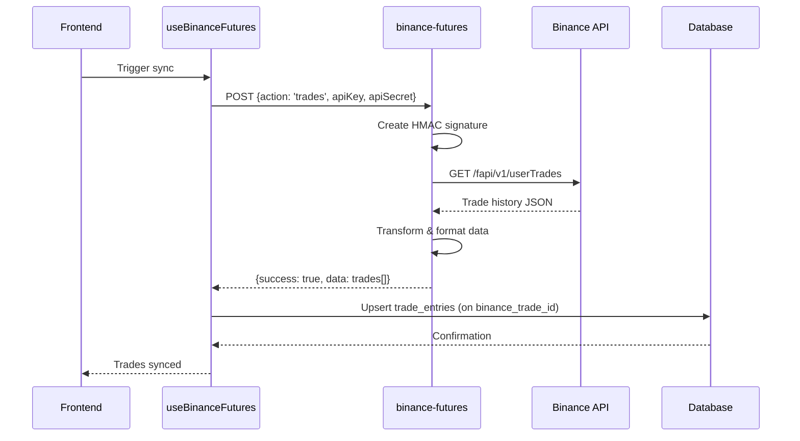
```mermaid
sequenceDiagram
    participant UI as Frontend
    participant Hook as useBinanceFutures
    participant EF as binance-futures
    participant Binance as Binance API
    participant DB as Database

    UI->>Hook: Trigger sync
    Hook->>EF: POST {action: 'trades', apiKey, apiSecret}
    EF->>EF: Create HMAC signature
    EF->>Binance: GET /fapi/v1/userTrades
    Binance-->>EF: Trade history JSON
    EF->>EF: Transform & format data
    EF-->>Hook: {success: true, data: trades[]}
    Hook->>DB: Upsert trade_entries (on binance_trade_id)
    DB-->>Hook: Confirmation
    Hook-->>UI: Trades synced
```

### 5.2 Trade Entry with AI Analysis Flow

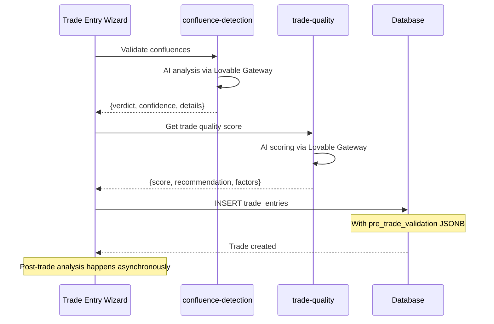
```mermaid
sequenceDiagram
    participant UI as Trade Entry Wizard
    participant Confluence as confluence-detection
    participant Quality as trade-quality
    participant DB as Database

    UI->>Confluence: Validate confluences
    Confluence->>Confluence: AI analysis via Lovable Gateway
    Confluence-->>UI: {verdict, confidence, details}
    
    UI->>Quality: Get trade quality score
    Quality->>Quality: AI scoring via Lovable Gateway
    Quality-->>UI: {score, recommendation, factors}
    
    UI->>DB: INSERT trade_entries
    Note over DB: With pre_trade_validation JSONB
    DB-->>UI: Trade created

    Note over UI: Post-trade analysis happens asynchronously
```

### 5.3 Account Balance Update Flow

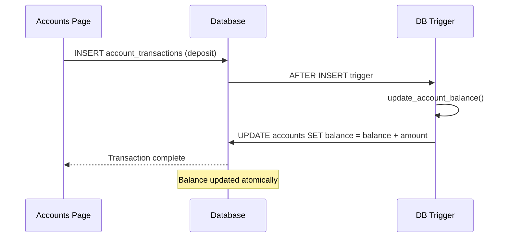
```mermaid
sequenceDiagram
    participant UI as Accounts Page
    participant DB as Database
    participant Trigger as DB Trigger

    UI->>DB: INSERT account_transactions (deposit)
    DB->>Trigger: AFTER INSERT trigger
    Trigger->>Trigger: update_account_balance()
    Trigger->>DB: UPDATE accounts SET balance = balance + amount
    DB-->>UI: Transaction complete
    
    Note over DB: Balance updated atomically
```

### 5.4 Market Insight Aggregation Flow

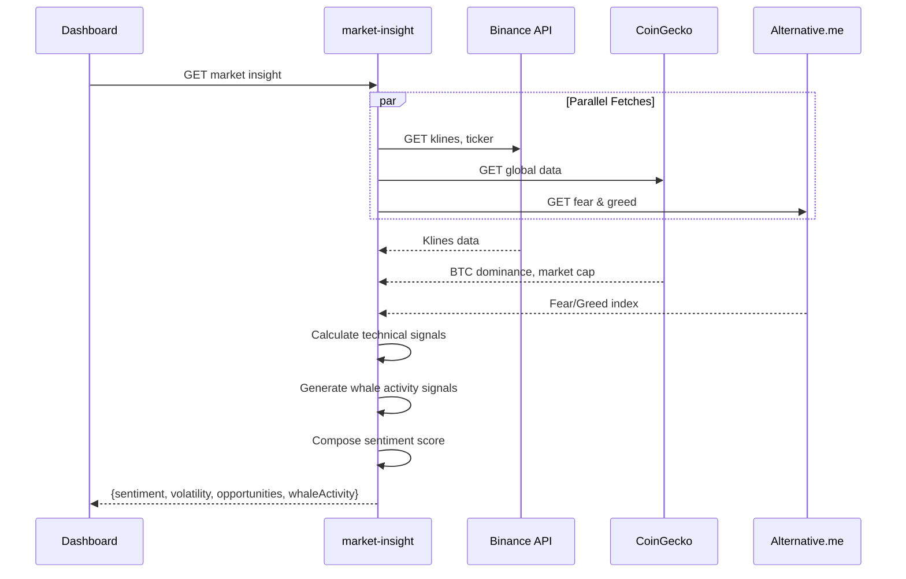
```mermaid
sequenceDiagram
    participant UI as Dashboard
    participant EF as market-insight
    participant Binance as Binance API
    participant CG as CoinGecko
    participant FG as Alternative.me

    UI->>EF: GET market insight
    
    par Parallel Fetches
        EF->>Binance: GET klines, ticker
        EF->>CG: GET global data
        EF->>FG: GET fear & greed
    end
    
    Binance-->>EF: Klines data
    CG-->>EF: BTC dominance, market cap
    FG-->>EF: Fear/Greed index
    
    EF->>EF: Calculate technical signals
    EF->>EF: Generate whale activity signals
    EF->>EF: Compose sentiment score
    
    EF-->>UI: {sentiment, volatility, opportunities, whaleActivity}
```

---

## 6. Edge Functions Overview

### 6.1 Function Inventory

| Function | Category | Auth Required | Database Access | External API |
|----------|----------|---------------|-----------------|--------------|
| `binance-futures` | API Proxy | Via body params | No | Binance Futures |
| `binance-market-data` | API Proxy | No | No | Binance Public |
| `ai-preflight` | AI | JWT | No | - |
| `trade-quality` | AI | No | No | Lovable AI Gateway |
| `dashboard-insights` | AI | No | No | Lovable AI Gateway |
| `post-trade-analysis` | AI | No | No | Lovable AI Gateway |
| `confluence-detection` | AI | No | No | Lovable AI Gateway |
| `macro-analysis` | Aggregation | No | No | CoinGecko, Binance, Alternative.me |
| `market-insight` | Aggregation | No | No | Binance, CoinGecko, Alternative.me |
| `economic-calendar` | Aggregation | No | No | Trading Economics |
| `youtube-strategy-import` | AI | No | No | Lovable AI Gateway |
| `backtest-strategy` | Computation | JWT | Read/Write | Binance (klines) |
| `check-permission` | Auth | JWT | Read | - |
| `strategy-clone-notify` | Notification | No | Read/Write | Resend Email |
| `trading-analysis` | AI (Streaming) | No | No | Lovable AI Gateway |
| `weekly-report` | Reporting | Optional | Read/Write | Resend Email |
| `sync-trading-pairs` | Data Sync | No | Write | Binance |

### 6.2 Detailed Function Documentation

#### `binance-futures` (1352 lines)

**Purpose**: Secure proxy for all Binance Futures authenticated endpoints.

**Trigger**: Frontend API calls via `useBinanceFutures` hook

**Supported Actions**:

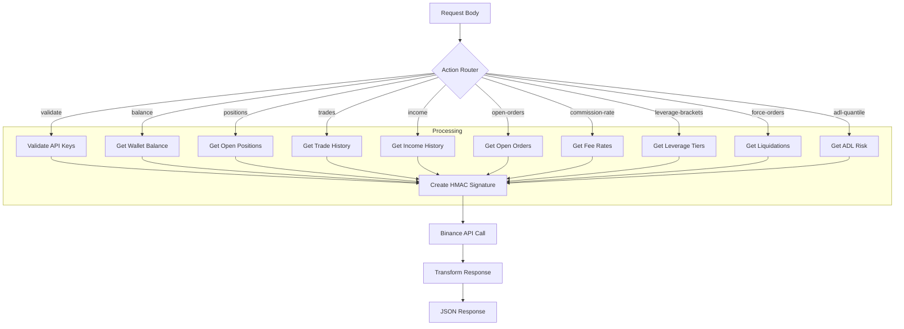
```mermaid
flowchart TB
    Input[Request Body] --> ActionRouter{Action Router}
    
    ActionRouter --> |validate| Validate[Validate API Keys]
    ActionRouter --> |balance| Balance[Get Wallet Balance]
    ActionRouter --> |positions| Positions[Get Open Positions]
    ActionRouter --> |trades| Trades[Get Trade History]
    ActionRouter --> |income| Income[Get Income History]
    ActionRouter --> |open-orders| Orders[Get Open Orders]
    ActionRouter --> |commission-rate| Commission[Get Fee Rates]
    ActionRouter --> |leverage-brackets| Leverage[Get Leverage Tiers]
    ActionRouter --> |force-orders| ForceOrders[Get Liquidations]
    ActionRouter --> |adl-quantile| ADL[Get ADL Risk]
    
    subgraph Processing
        Validate --> HMAC[Create HMAC Signature]
        Balance --> HMAC
        Positions --> HMAC
        Trades --> HMAC
        Income --> HMAC
        Orders --> HMAC
        Commission --> HMAC
        Leverage --> HMAC
        ForceOrders --> HMAC
        ADL --> HMAC
    end
    
    HMAC --> BinanceAPI[Binance API Call]
    BinanceAPI --> Transform[Transform Response]
    Transform --> Output[JSON Response]
```

**Input Schema**:
```typescript
interface BinanceFuturesRequest {
  action: string;
  apiKey: string;
  apiSecret: string;
  symbol?: string;
  limit?: number;
  startTime?: number;
  endTime?: number;
  incomeType?: string;
}
```

**Output Schema**:
```typescript
interface BinanceFuturesResponse {
  success: boolean;
  data?: T;
  error?: string;
  code?: number;  // Binance error code
}
```

**Error Cases**:
- Invalid API credentials → `{success: false, code: -2014}`
- Rate limit exceeded → `{success: false, code: -1003}`
- Invalid signature → `{success: false, code: -2015}`

---

#### `market-insight` (420 lines)

**Purpose**: Multi-symbol market analysis with technical indicators and whale signals.

**Trigger**: Frontend via `useMarketSentiment` hook

**Internal Flow**:

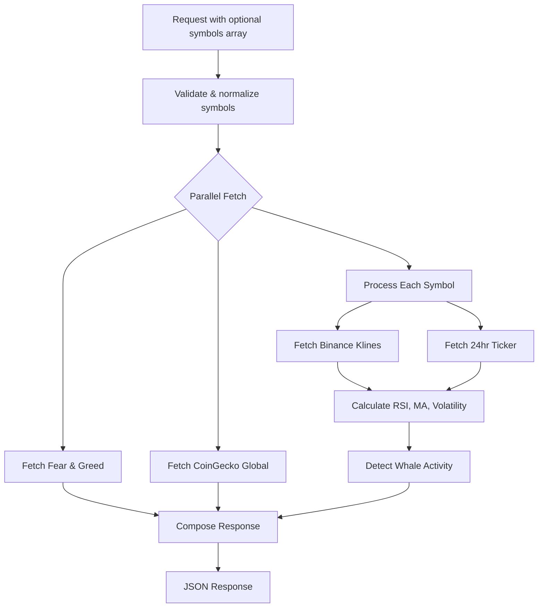
```mermaid
flowchart TB
    Request[Request with optional symbols array] --> Validate[Validate & normalize symbols]
    Validate --> Parallel{Parallel Fetch}
    
    Parallel --> FearGreed[Fetch Fear & Greed]
    Parallel --> Global[Fetch CoinGecko Global]
    Parallel --> Symbols[Process Each Symbol]
    
    Symbols --> Klines[Fetch Binance Klines]
    Symbols --> Ticker[Fetch 24hr Ticker]
    
    Klines --> Technical[Calculate RSI, MA, Volatility]
    Ticker --> Technical
    Technical --> WhaleSignal[Detect Whale Activity]
    
    FearGreed --> Compose[Compose Response]
    Global --> Compose
    WhaleSignal --> Compose
    
    Compose --> Output[JSON Response]
```

**Output Structure**:
```typescript
interface MarketInsightResponse {
  sentiment: {
    overall: 'bullish' | 'bearish' | 'neutral';
    confidence: number;
    signals: TechnicalSignal[];
    fearGreed: { value: number; label: string };
    recommendation: string;
  };
  volatility: VolatilityData[];
  opportunities: Opportunity[];
  whaleActivity: WhaleSignal[];
  lastUpdated: string;
}
```

---

#### `confluence-detection`

**Purpose**: AI-powered validation of trading strategy confluences.

**Trigger**: Trade Entry Wizard before trade execution

**Input**:
```typescript
interface DetectionRequest {
  pair: string;
  direction: 'LONG' | 'SHORT';
  entryPrice: number;
  stopLoss: number;
  takeProfit: number;
  timeframe: string;
  strategyRules: EntryRule[];
  strategyName: string;
}
```

**Output**:
```typescript
interface ConfluenceResult {
  details: Array<{
    id: string;
    detected: boolean;
    confidence: number;
    description: string;
  }>;
  overall_confidence: number;
  verdict: 'pass' | 'fail' | 'warning';
  recommendation: string;
  confluences_detected: number;
  confluences_required: number;
}
```

---

#### `backtest-strategy`

**Purpose**: Run historical backtests for trading strategies.

**Trigger**: Strategy page backtest button

**Flow**:

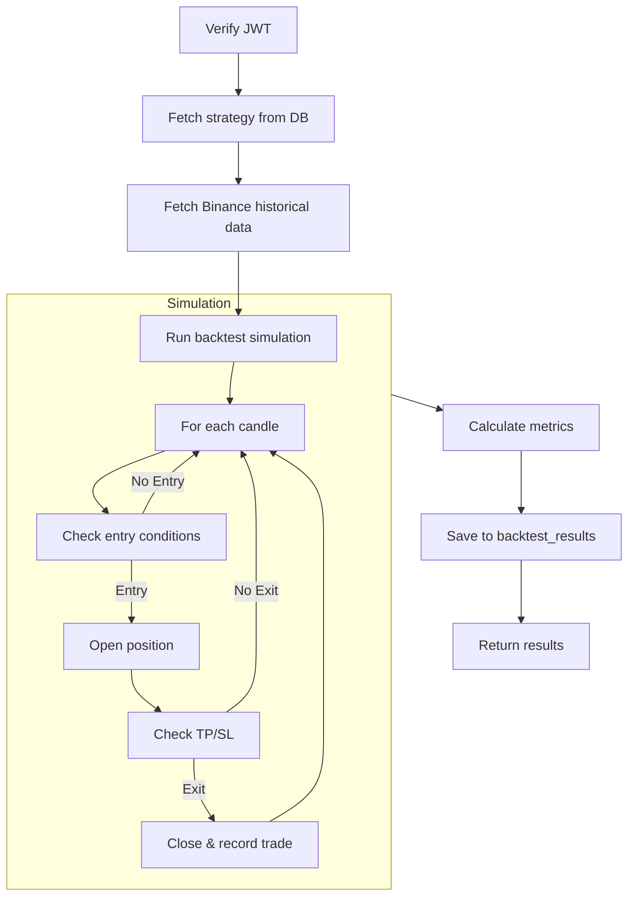
```mermaid
flowchart TB
    Auth[Verify JWT] --> GetStrategy[Fetch strategy from DB]
    GetStrategy --> FetchKlines[Fetch Binance historical data]
    FetchKlines --> Simulate[Run backtest simulation]
    
    subgraph Simulation
        Simulate --> ForEachCandle[For each candle]
        ForEachCandle --> CheckEntry[Check entry conditions]
        CheckEntry --> |Entry| OpenPosition[Open position]
        CheckEntry --> |No Entry| ForEachCandle
        OpenPosition --> CheckExit[Check TP/SL]
        CheckExit --> |Exit| ClosePosition[Close & record trade]
        CheckExit --> |No Exit| ForEachCandle
        ClosePosition --> ForEachCandle
    end
    
    Simulation --> CalcMetrics[Calculate metrics]
    CalcMetrics --> SaveDB[Save to backtest_results]
    SaveDB --> Output[Return results]
```

**Database Interaction**: READ `trading_strategies`, WRITE `backtest_results`

---

#### `weekly-report`

**Purpose**: Generate weekly trading performance reports with email delivery.

**Trigger**: Cron job or manual API call

**Flow**:

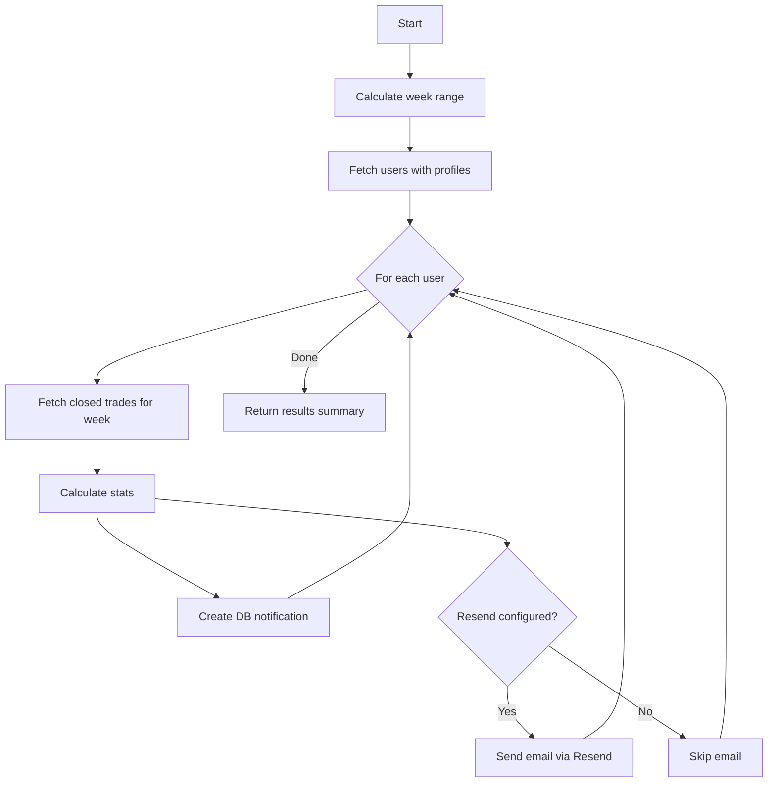
```mermaid
flowchart TB
    Start[Start] --> CalcWeekRange[Calculate week range]
    CalcWeekRange --> FetchUsers[Fetch users with profiles]
    
    FetchUsers --> ForEachUser{For each user}
    ForEachUser --> FetchTrades[Fetch closed trades for week]
    FetchTrades --> CalcStats[Calculate stats]
    
    CalcStats --> CreateNotif[Create DB notification]
    CalcStats --> CheckEmail{Resend configured?}
    CheckEmail --> |Yes| SendEmail[Send email via Resend]
    CheckEmail --> |No| Skip[Skip email]
    
    CreateNotif --> ForEachUser
    SendEmail --> ForEachUser
    Skip --> ForEachUser
    
    ForEachUser --> |Done| Output[Return results summary]
```

**Database Interaction**: 
- READ: `users_profile`, `trade_entries`, `user_settings`
- WRITE: `notifications`

---

## 7. Database ↔ Edge Function Interaction

### Dependency Matrix

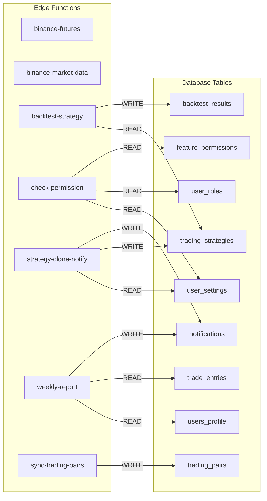
```mermaid
graph LR
    subgraph EdgeFunctions["Edge Functions"]
        BF[binance-futures]
        BM[binance-market-data]
        BS[backtest-strategy]
        CP[check-permission]
        SCN[strategy-clone-notify]
        WR[weekly-report]
        STP[sync-trading-pairs]
    end

    subgraph Tables["Database Tables"]
        TE[trade_entries]
        TS[trading_strategies]
        BR[backtest_results]
        US[user_settings]
        UR[user_roles]
        FP[feature_permissions]
        UP[users_profile]
        NO[notifications]
        TP[trading_pairs]
    end

    BS --> |READ| TS
    BS --> |WRITE| BR
    
    CP --> |READ| US
    CP --> |READ| UR
    CP --> |READ| FP
    
    SCN --> |READ| US
    SCN --> |WRITE| TS
    SCN --> |WRITE| NO
    
    WR --> |READ| UP
    WR --> |READ| TE
    WR --> |WRITE| NO
    
    STP --> |WRITE| TP
```

### Operation Types by Function

| Function | Tables Accessed | Operations |
|----------|-----------------|------------|
| `backtest-strategy` | `trading_strategies`, `backtest_results` | R, W |
| `check-permission` | `user_settings`, `user_roles`, `feature_permissions` | R |
| `strategy-clone-notify` | `user_settings`, `trading_strategies`, `notifications` | R, W |
| `weekly-report` | `users_profile`, `trade_entries`, `notifications` | R, W |
| `sync-trading-pairs` | `trading_pairs` | W (Upsert) |

### Impact Analysis

> **Question**: *"If `trading_strategies` table changes, which functions are affected?"*

| Table | Affected Functions | Impact Level |
|-------|-------------------|--------------|
| `trading_strategies` | `backtest-strategy`, `strategy-clone-notify` | HIGH |
| `trade_entries` | `weekly-report` | MEDIUM |
| `user_settings` | `check-permission`, `strategy-clone-notify` | LOW |
| `trading_pairs` | `sync-trading-pairs` | LOW |

---

## 8. Derived Data & Calculation Strategy

### What's Computed at Runtime

| Metric | Calculation Location | Data Source | Risk |
|--------|---------------------|-------------|------|
| **Win Rate** | Frontend (hooks) | `trade_entries` WHERE result | None |
| **Total P&L** | Frontend (hooks) | SUM(realized_pnl) | None |
| **Current Balance** | DB Trigger | `account_transactions` | Race condition possible |
| **Daily Loss %** | Frontend | `trade_entries` by date | None |
| **Equity Curve** | Backtest function | Computed per simulation | None |

### What's Pre-Computed & Stored

| Metric | Storage Location | When Computed | Staleness Risk |
|--------|-----------------|---------------|----------------|
| **Balance Snapshots** | `account_balance_snapshots` | Daily snapshot job | Low |
| **Risk Snapshots** | `daily_risk_snapshots` | On trading activity | Low |
| **AI Analysis** | `trade_entries.post_trade_analysis` | Once after trade closes | None (immutable) |
| **Backtest Metrics** | `backtest_results.metrics` | On backtest run | None (immutable) |
| **Clone Count** | `trading_strategies.clone_count` | On clone event | Very low |

### Race Condition Analysis

**Scenario**: Two concurrent deposits to the same account

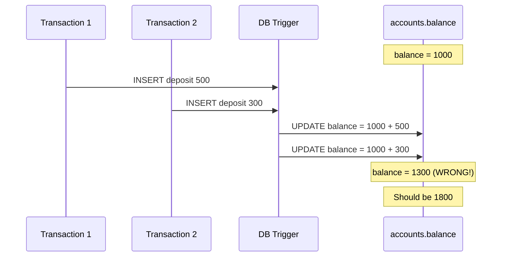
```mermaid
sequenceDiagram
    participant T1 as Transaction 1
    participant T2 as Transaction 2
    participant Trigger as DB Trigger
    participant Accounts as accounts.balance

    Note over Accounts: balance = 1000
    
    T1->>Trigger: INSERT deposit 500
    T2->>Trigger: INSERT deposit 300
    
    Trigger->>Accounts: UPDATE balance = 1000 + 500
    Trigger->>Accounts: UPDATE balance = 1000 + 300
    
    Note over Accounts: balance = 1300 (WRONG!)
    Note over Accounts: Should be 1800
```

**Mitigation**: The trigger uses `balance = balance + amount` which is atomic:
```sql
UPDATE accounts SET balance = balance + NEW.amount WHERE id = NEW.account_id;
```

This is row-level locked, so concurrent updates are serialized.

---

## 9. Data Integrity & Consistency Rules

### Database Constraints

| Table | Constraint | Type | Purpose |
|-------|-----------|------|---------|
| `risk_profiles` | `user_id` UNIQUE | Unique | One profile per user |
| `trading_strategies` | `share_token` UNIQUE | Unique | Unique share links |
| `trade_entries` | `binance_trade_id` | None | **ASSUMPTION**: Should be unique per user |
| `user_roles` | `(user_id, role)` | Unique | One role per type per user |

### Trigger-Based Validation

| Trigger | Table | Event | Action |
|---------|-------|-------|--------|
| `update_account_balance` | `account_transactions` | INSERT | Update `accounts.balance` |
| `update_accounts_updated_at` | `accounts` | UPDATE | Set `updated_at = now()` |
| `update_risk_profiles_updated_at` | `risk_profiles` | UPDATE | Set `updated_at = now()` |
| `update_trading_account_from_trade` | `trade_entries` | INSERT/UPDATE | Update account balance on closed trades |

### Foreign Key Relationships

```sql
-- Active FK constraints
account_balance_snapshots.account_id → accounts.id
account_transactions.account_id → accounts.id
backtest_results.strategy_id → trading_strategies.id
trade_entries.trading_account_id → accounts.id
trade_entry_strategies.trade_entry_id → trade_entries.id
trade_entry_strategies.strategy_id → trading_strategies.id
user_settings.default_trading_account_id → accounts.id
```

### Data Validation Rules

| Rule | Enforcement | Level |
|------|-------------|-------|
| `trade_entries.direction` IN ('LONG', 'SHORT') | Frontend | Application |
| `trade_entries.status` IN ('pending', 'open', 'closed') | Frontend | Application |
| `risk_profiles` percentages > 0 | Frontend | Application |
| `account_transactions.amount` > 0 | Frontend | Application |

**ASSUMPTION**: No CHECK constraints exist for these validations. Data integrity relies on application-level validation.

---

## 10. Performance & Scalability Considerations

### Query Patterns

| Pattern | Frequency | Tables | Optimization |
|---------|-----------|--------|--------------|
| Trade history by date | High | `trade_entries` | Index on `(user_id, trade_date)` |
| Strategy lookup | High | `trading_strategies` | Index on `user_id` |
| Account balance | Medium | `accounts` | Index on `user_id` |
| Risk events by date | Low | `risk_events` | Index on `(user_id, event_date)` |

### Current Indexes

**ASSUMPTION**: Standard Supabase indexes exist on:
- All primary keys (`id`)
- All foreign keys (`*_id`)
- `user_id` columns

### Potential Bottlenecks

| Area | Issue | Severity | Mitigation |
|------|-------|----------|------------|
| Trade sync | Large trade history fetch | Medium | Pagination with `startTime`/`endTime` |
| Backtest | Historical data fetch | High | Binance pagination, caching |
| Market insight | 5-10 parallel API calls | Medium | In-memory caching, rate limiting |
| Weekly report | N users × M trades | Low | Background job, batching |

### Read vs Write Profile

| Table | Read Heavy | Write Heavy | Pattern |
|-------|------------|-------------|---------|
| `trade_entries` | ✅ | Moderate | Read for analytics, write on sync |
| `trading_strategies` | ✅ | Low | Read often, rarely modified |
| `account_balance_snapshots` | Low | ✅ | Daily writes, rare reads |
| `risk_events` | Low | ✅ | Append-only audit log |
| `trading_pairs` | ✅ | Low | Read for validation, periodic sync |

---

## 11. Security & Access Control

### Row-Level Security (RLS) Summary

| Table | Policy | Access Pattern |
|-------|--------|----------------|
| `trade_entries` | `auth.uid() = user_id` | Full CRUD own data |
| `accounts` | `auth.uid() = user_id` | Full CRUD own data |
| `trading_strategies` | `auth.uid() = user_id OR is_shared` | CRUD own + read shared |
| `trading_pairs` | `true` (SELECT only) | Public read |
| `feature_permissions` | `true` (SELECT) / `is_admin()` (ALL) | Public read, admin write |
| `user_roles` | `auth.uid() = user_id` (SELECT) / `is_admin()` (MODIFY) | Read own, admin modify |

### Access Control Matrix

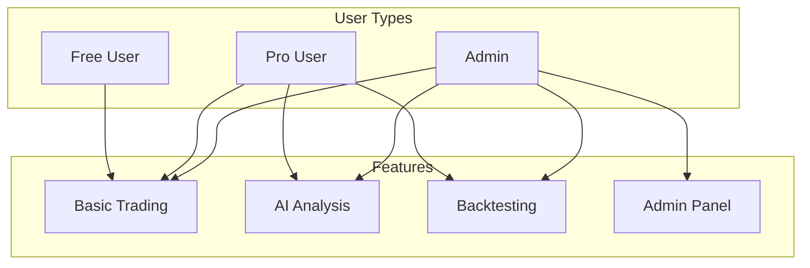
```mermaid
graph TB
    subgraph Users["User Types"]
        Free[Free User]
        Pro[Pro User]
        Admin[Admin]
    end

    subgraph Features["Features"]
        BasicTrading[Basic Trading]
        AIAnalysis[AI Analysis]
        Backtest[Backtesting]
        AdminPanel[Admin Panel]
    end

    Free --> BasicTrading
    Pro --> BasicTrading
    Pro --> AIAnalysis
    Pro --> Backtest
    Admin --> BasicTrading
    Admin --> AIAnalysis
    Admin --> Backtest
    Admin --> AdminPanel
```

### Edge Function Security

| Function | Auth Method | Sensitive Data Handling |
|----------|-------------|------------------------|
| `binance-futures` | API keys in request body | Keys never stored, only proxied |
| `check-permission` | JWT Bearer token | Token validated server-side |
| `backtest-strategy` | JWT Bearer token | User can only access own strategies |
| `weekly-report` | Service role (internal) | Admin-level access |

### Credential Handling

**Binance API Credentials**:
- Passed in request body (encrypted in transit via HTTPS)
- Never persisted to database
- Never logged
- Immediately discarded after request

**ASSUMPTION**: Users manage their own API keys externally. No credential storage feature exists.

---

## 12. Known Gaps & TODO

### ✅ RESOLVED Issues (2026-02-01)

| Issue | Resolution | Migration |
|-------|------------|-----------|
| No unique constraint on `binance_trade_id` | ✅ **FIXED**: Added per-user unique index `idx_trade_entries_binance_trade_per_user` | TIER 1 Migration |
| No CHECK constraints for enums | ✅ **FIXED**: Added `trade_entries_direction_check`, `trade_entries_source_check` | TIER 1 Migration |
| No CHECK on amounts | ✅ **FIXED**: Added `account_transactions_amount_positive` | TIER 1 Migration |
| No CHECK on risk percentages | ✅ **FIXED**: Added 6 constraints for `risk_profiles` | TIER 1 Migration |

### Remaining Gaps

| Gap | Area | Impact | Recommended Fix | Priority |
|-----|------|--------|-----------------|----------|
| Missing index for date range queries | `trade_entries` | Slow analytics | Add `(user_id, trade_date)` index | Medium |
| No soft delete | `accounts`, `strategies` | Data loss on delete | Add `deleted_at` column | Medium |
| No pagination in trade history | `trade_entries` | Performance | Cursor-based pagination | Medium |
| AI analysis not versioned | `trade_entries` | Consistency | Add `ai_model_version` column | Low |

### Assumptions Made

| ID | Assumption | Area | Verification Needed |
|----|------------|------|---------------------|
| A1 | Balance trigger is atomic | `account_transactions` | Test concurrent deposits |
| A2 | Standard Supabase indexes exist | All tables | Query explain analysis |
| A3 | RLS policies cover all edge cases | All tables | Security audit |
| A4 | Binance rate limits are handled | Edge functions | Monitor 429 responses |

### Missing Documentation

| Item | Status | Priority |
|------|--------|----------|
| API rate limit handling strategy | Not documented | Medium |
| Error recovery procedures | Not documented | High |
| Data retention policy | Not defined | Medium |
| Backup/restore procedures | Not documented | Low |

### Resolved Design Issues (2026-02-01)

| Issue | Resolution | Implementation |
|-------|------------|----------------|
| No pagination in trade history query | ✅ RESOLVED | Cursor-based pagination with `useTradeEntriesPaginated` hook and `TradeHistoryInfiniteScroll` component |
| Backtest simulation is simplified | ✅ RESOLVED | Added `BacktestDisclaimer` component, `assumptions` JSONB, `accuracy_notes` TEXT, and `simulation_version` columns |
| AI analysis not versioned | ✅ RESOLVED | Added `ai_model_version` and `ai_analysis_generated_at` columns, `_metadata` object in JSONB |
| Clone count not transaction-safe | ✅ RESOLVED | Created `increment_clone_count(p_strategy_id UUID)` RPC function for atomic operations |
| Balance verification missing | ✅ RESOLVED | Created `account_balance_discrepancies` table, `reconcile-balances` Edge Function, and `useBalanceReconciliation` hook |
| No soft delete support | ✅ RESOLVED | Added `deleted_at` columns to `trade_entries`, `trading_strategies`, `accounts` with RLS policies |
| Error handling not documented | ✅ RESOLVED | Created `docs/EDGE_FUNCTION_ERROR_HANDLING.md`, shared `retry.ts` and `error-response.ts` utilities |

### Future Considerations

1. **Data Archival**: Consider archiving old `trade_entries` after 2+ years
2. **Read Replicas**: For analytics-heavy workloads
3. **Event Sourcing**: For audit-critical operations
4. **Caching Layer**: Redis for market data caching
5. **Automated Reconciliation**: Schedule daily balance reconciliation job

---

## Appendix A: Database Function Reference

```sql
-- Generate unique share token
generate_share_token() → TEXT

-- Permission checking
has_permission(_feature_key TEXT, _user_id UUID) → BOOLEAN
has_role(_role app_role, _user_id UUID) → BOOLEAN
has_subscription(_min_tier subscription_tier, _user_id UUID) → BOOLEAN
is_admin(_user_id UUID) → BOOLEAN
get_user_subscription(_user_id UUID) → subscription_tier

-- Atomic operations (Added 2026-02-01)
increment_clone_count(p_strategy_id UUID) → VOID
```

## Appendix B: Enum Types

```sql
-- Account types (DB has 9, app uses 2)
account_type: bank | ewallet | broker | cash | soft_wallet | investment | emergency | goal_savings | trading

-- Transaction types
account_transaction_type: deposit | withdrawal | transfer_in | transfer_out | expense | income | transfer

-- User roles
app_role: admin | user

-- Subscription tiers
subscription_tier: free | pro | business
```

## Appendix C: Database Constraints (Added 2026-02-01)

### trade_entries Constraints

| Constraint Name | Type | Definition |
|-----------------|------|------------|
| `trade_entries_direction_check` | CHECK | `direction IN ('LONG', 'SHORT', 'long', 'short')` |
| `trade_entries_source_check` | CHECK | `source IS NULL OR source IN ('binance', 'manual', 'paper', 'import')` |
| `idx_trade_entries_binance_trade_per_user` | UNIQUE INDEX | `(user_id, binance_trade_id) WHERE binance_trade_id IS NOT NULL` |

### account_transactions Constraints

| Constraint Name | Type | Definition |
|-----------------|------|------------|
| `account_transactions_amount_positive` | CHECK | `amount > 0` |

### risk_profiles Constraints

| Constraint Name | Type | Definition |
|-----------------|------|------------|
| `risk_profiles_risk_per_trade_check` | CHECK | `risk_per_trade_percent IS NULL OR (> 0 AND <= 100)` |
| `risk_profiles_max_daily_loss_check` | CHECK | `max_daily_loss_percent IS NULL OR (> 0 AND <= 100)` |
| `risk_profiles_max_weekly_drawdown_check` | CHECK | `max_weekly_drawdown_percent IS NULL OR (> 0 AND <= 100)` |
| `risk_profiles_max_position_size_check` | CHECK | `max_position_size_percent IS NULL OR (> 0 AND <= 100)` |
| `risk_profiles_max_correlated_exposure_check` | CHECK | `max_correlated_exposure IS NULL OR (> 0 AND <= 1)` |
| `risk_profiles_max_concurrent_positions_check` | CHECK | `max_concurrent_positions IS NULL OR > 0` |

## Appendix D: Soft Delete Support (Added 2026-02-01)

### Tables with Soft Delete

| Table | Column | RLS Filter |
|-------|--------|------------|
| `trade_entries` | `deleted_at TIMESTAMPTZ` | `deleted_at IS NULL` |
| `trading_strategies` | `deleted_at TIMESTAMPTZ` | `deleted_at IS NULL` |
| `accounts` | `deleted_at TIMESTAMPTZ` | `deleted_at IS NULL` |

### Partial Indexes for Performance

```sql
CREATE INDEX idx_trade_entries_deleted_at ON trade_entries (deleted_at) WHERE deleted_at IS NULL;
CREATE INDEX idx_trading_strategies_deleted_at ON trading_strategies (deleted_at) WHERE deleted_at IS NULL;
CREATE INDEX idx_accounts_deleted_at ON accounts (deleted_at) WHERE deleted_at IS NULL;
```

## Appendix E: Balance Reconciliation System (Added 2026-02-01)

### account_balance_discrepancies Table

| Column | Type | Description |
|--------|------|-------------|
| `id` | UUID | Primary key |
| `user_id` | UUID | Owner |
| `account_id` | UUID | FK to accounts |
| `expected_balance` | NUMERIC | Calculated from transactions |
| `actual_balance` | NUMERIC | Stored in accounts table |
| `discrepancy` | NUMERIC | Difference |
| `detected_at` | TIMESTAMPTZ | When detected |
| `resolved` | BOOLEAN | Resolution status |
| `resolution_method` | TEXT | auto_fix / manual / ignored |

### Reconciliation Edge Function

- **Endpoint**: `reconcile-balances`
- **Trigger**: On-demand via Settings page
- **Auto-fix threshold**: $10 (configurable)
- **Logs**: All discrepancies stored for audit

## Appendix F: AI Analysis Versioning (Added 2026-02-01)

### Version Tracking Columns

| Table | Column | Description |
|-------|--------|-------------|
| `trade_entries` | `ai_model_version` | Model identifier (e.g., `gemini-2.5-flash-2026-02`) |
| `trade_entries` | `ai_analysis_generated_at` | Timestamp of AI generation |

### Metadata Object in JSONB

```json
{
  "_metadata": {
    "model": "gemini-2.5-flash-2026-02",
    "generatedAt": "2026-02-01T08:00:00Z",
    "promptVersion": 3
  },
  "lessons": [...],
  "improvements": [...]
}
```

---

*Document generated for Trading Journey project. For updates, see version control history.*
*Last comprehensive update: 2026-02-01 - All Phase 1-3 issues resolved.*
