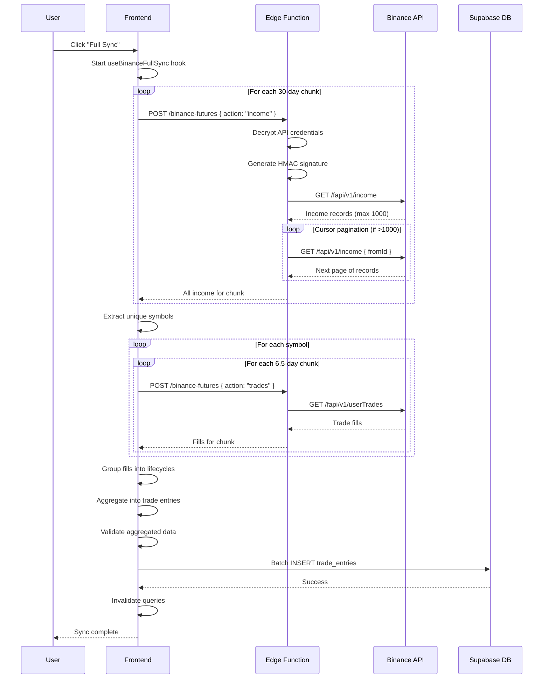
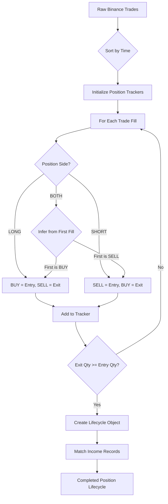
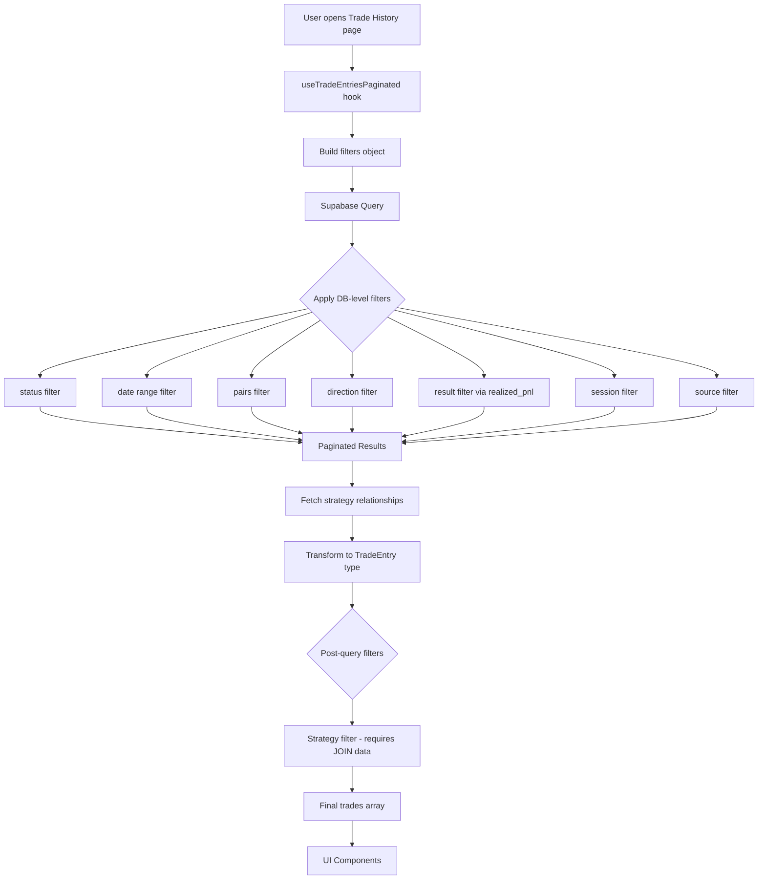
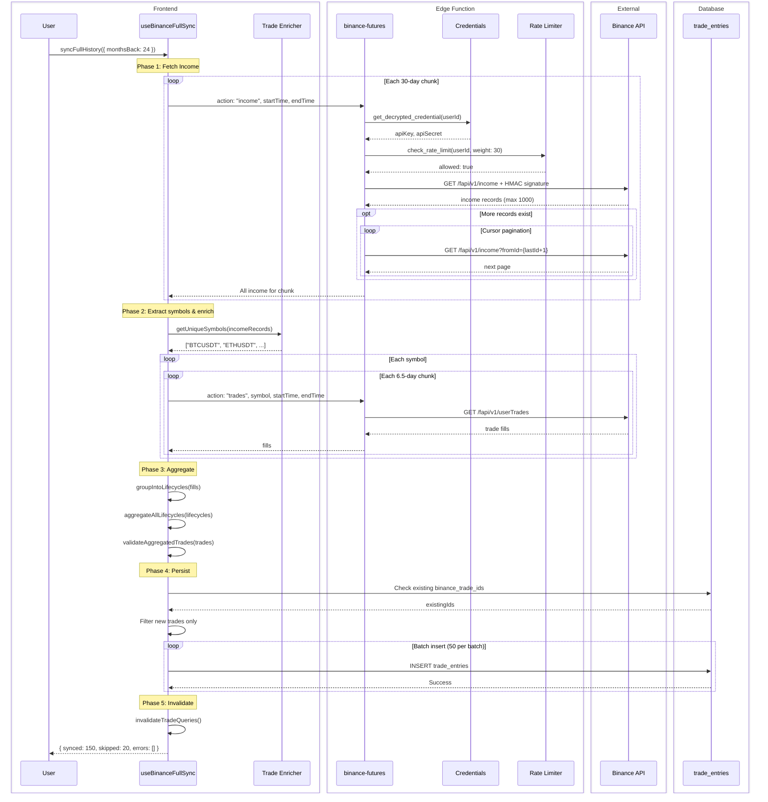
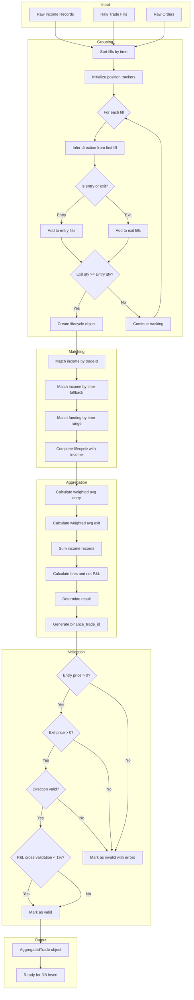
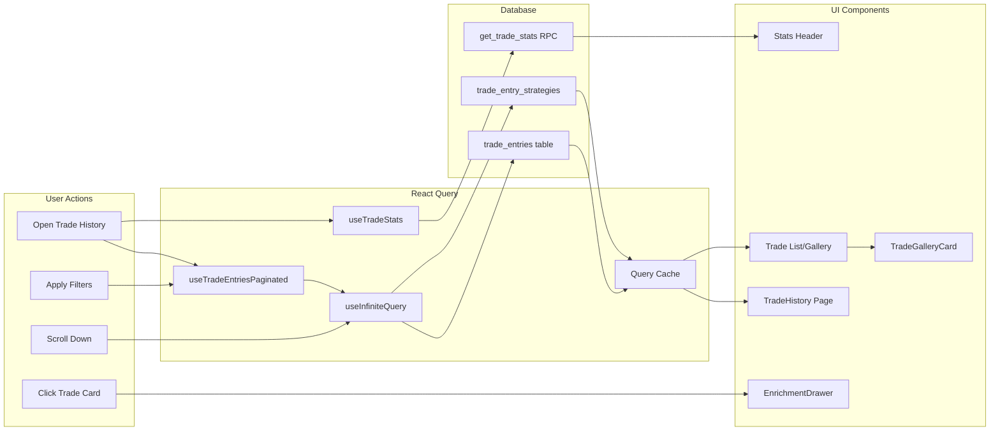
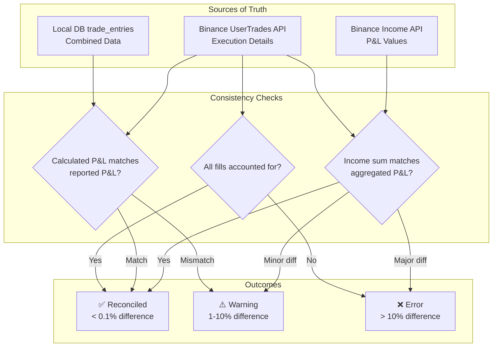

# Trade History Complete Flow Documentation

**Version:** 2.0  
**Last Updated:** 2026-02-08  
**Status:** Production-Ready  
**Maintainer:** System Architecture Team

---

## Table of Contents

1. [Purpose & Scope](#1-purpose--scope)
2. [Trade Definition (Domain Foundation)](#2-trade-definition-domain-foundation)
3. [Data Sources](#3-data-sources)
4. [Binance Data Ingestion Flow](#4-binance-data-ingestion-flow)
5. [Aggregation & Normalization Process](#5-aggregation--normalization-process)
6. [Local Database Schema Mapping](#6-local-database-schema-mapping)
7. [Sync Strategy & Data Consistency](#7-sync-strategy--data-consistency)
8. [Data Flow to Frontend](#8-data-flow-to-frontend)
9. [UI Consumption Rules](#9-ui-consumption-rules)
10. [Failure & Edge Cases](#10-failure--edge-cases)
11. [Known Risks & Anti-Patterns](#11-known-risks--anti-patterns)
12. [Mermaid Diagrams](#12-mermaid-diagrams)

---

## 1. Purpose & Scope

### 1.1 What is Trade History?

Trade History adalah **core feature** yang merekam, menyimpan, dan menyajikan seluruh riwayat trading yang telah ditutup (closed positions). Ini adalah **ledger kebenaran** untuk:

- **Performance Analytics** — Kalkulasi win rate, profit factor, average P&L
- **Trading Journal** — Enrichment dengan notes, screenshots, strategy tagging
- **AI Analysis** — Input data untuk quality scoring dan pattern recognition
- **Tax/Audit** — Record keeping untuk keperluan finansial

### 1.2 Why is Trade History a Core Feature?

| Aspect | Dependency |
|--------|------------|
| Dashboard P&L Cards | Reads from `trade_entries` |
| Analytics Charts | Aggregates from `trade_entries` |
| Journal Feature | Enriches `trade_entries` |
| AI Quality Score | Analyzes `trade_entries` |
| Weekly Reports | Summarizes `trade_entries` |
| Risk Management | Monitors `trade_entries` patterns |

**Tanpa Trade History yang akurat, seluruh sistem analytics menjadi tidak valid.**

### 1.3 Scope Definition

#### ✅ INCLUDED dalam Trade History:

- Closed positions dari Binance Futures
- Paper trades (manual entry)
- Enrichment data (notes, screenshots, strategies)
- Commission dan funding fees terkait trade
- AI analysis results

#### ❌ NOT INCLUDED:

- Open positions (lihat Position module)
- Pending orders (lihat Orders module)
- Account balance snapshots (lihat Balance module)
- Transfer/deposit/withdrawal (lihat Transactions module)

---

## 2. Trade Definition (Domain Foundation)

### 2.1 What is "1 Trade"?

```
┌─────────────────────────────────────────────────────────────────────┐
│                    DEFINITION: 1 TRADE                               │
└─────────────────────────────────────────────────────────────────────┘

1 TRADE = 1 COMPLETE POSITION LIFECYCLE

Position Lifecycle = Position opened → Position closed
                   = Net quantity goes: 0 → X → 0

A trade entry in our database represents ONE COMPLETE ROUND-TRIP:
- From: First entry fill (position opened)
- To: Last exit fill (position fully closed)
```

### 2.2 Terminology Distinctions

| Term | Definition | Example |
|------|------------|---------|
| **Order** | Request to buy/sell at specified price | "LIMIT BUY 0.1 BTC @ $50,000" |
| **Fill** | Actual execution of (part of) an order | "0.05 BTC filled @ $50,010" |
| **Position** | Current net exposure in a symbol | "LONG 0.1 BTC, entry $50,000" |
| **Trade Entry** | Complete lifecycle record in local DB | All data from open to close |

### 2.3 Fill Aggregation Rules

```
┌─────────────────────────────────────────────────────────────────────┐
│                    FILL AGGREGATION                                  │
└─────────────────────────────────────────────────────────────────────┘

SCENARIO: User opens LONG BTCUSDT with 3 entry orders

Fill 1: BUY 0.05 BTC @ $50,000  (First entry)
Fill 2: BUY 0.03 BTC @ $50,100  (Scale-in)
Fill 3: BUY 0.02 BTC @ $49,800  (Scale-in)
---
Total Entry: 0.10 BTC

Fill 4: SELL 0.04 BTC @ $51,000 (Partial close)
Fill 5: SELL 0.06 BTC @ $51,500 (Final close)
---
Total Exit: 0.10 BTC → Position CLOSED

RESULT: 1 Trade Entry created with:
- Entry Price: Weighted average = (0.05×50000 + 0.03×50100 + 0.02×49800) / 0.10
             = $49,990
- Exit Price: Weighted average = (0.04×51000 + 0.06×51500) / 0.10
            = $51,300
- Quantity: 0.10 BTC
- Direction: LONG (from first fill)
```

### 2.4 Special Cases

#### Partial Close (Position Not Yet Closed)

```
Entry: BUY 0.10 BTC @ $50,000
Exit:  SELL 0.04 BTC @ $51,000 ← Partial
       Remaining: 0.06 BTC still open

RESULT: NO trade entry created yet (position incomplete)
        Income records exist but marked as "unmatched"
```

#### Scale-In After Partial Close

```
Entry 1: BUY 0.10 BTC @ $50,000
Exit 1:  SELL 0.04 BTC @ $51,000 ← Partial
Entry 2: BUY 0.02 BTC @ $50,500 ← Scale-in
Exit 2:  SELL 0.08 BTC @ $52,000 ← Final close

RESULT: Complex lifecycle - may split into multiple trades
        depending on position tracking algorithm
```

#### Position Flip (LONG → SHORT without closing)

```
LONG 0.10 BTC @ $50,000
SELL 0.15 BTC @ $51,000 ← Closes LONG + Opens SHORT 0.05

RESULT: 
- Trade 1: LONG 0.10 BTC (closed with profit)
- Position: SHORT 0.05 BTC (new, still open)
```

---

## 3. Data Sources

### 3.1 Primary Source: Binance Futures API

| Endpoint | Purpose | Data Type | Rate Limit |
|----------|---------|-----------|------------|
| `/fapi/v1/income` | P&L, fees, funding | Income records | Weight: 30 |
| `/fapi/v1/userTrades` | Actual fills | Trade fills | Weight: 5 |
| `/fapi/v1/allOrders` | Order history | Order records | Weight: 5 |
| `/fapi/v1/forceOrders` | Liquidations | Liquidation records | Weight: 20 |

#### Income API (`/fapi/v1/income`)

**Purpose:** Source of truth for P&L values

**Data Retrieved:**
```typescript
interface BinanceIncome {
  symbol: string;          // "BTCUSDT"
  incomeType: string;      // "REALIZED_PNL", "COMMISSION", "FUNDING_FEE"
  income: number;          // 15.32 (positive) or -8.21 (negative)
  asset: string;           // "USDT"
  time: number;            // Unix timestamp ms
  tranId: number;          // Unique transaction ID
  tradeId?: string;        // Trade ID for linking (may be null)
}
```

**Limitations:**
- Max 1000 records per request
- Max 90 days per request (we use 90-day chunks for maximum efficiency)
- No entry/exit price information
- No quantity information
- No direction information

#### UserTrades API (`/fapi/v1/userTrades`)

**Purpose:** Source of truth for execution details

**Data Retrieved:**
```typescript
interface BinanceTrade {
  id: number;              // Fill ID
  symbol: string;          // "BTCUSDT"
  orderId: number;         // Parent order ID
  side: "BUY" | "SELL";    // Trade side
  price: number;           // Execution price
  qty: number;             // Executed quantity
  realizedPnl: number;     // P&L from this fill
  commission: number;      // Fee for this fill
  commissionAsset: string; // Fee asset
  time: number;            // Execution timestamp
  positionSide: "LONG" | "SHORT" | "BOTH";
  maker: boolean;          // Maker or taker
}
```

**Limitations:**
- **CRITICAL: Max 7 days per request** — We use 6.5-day chunks
- Requires symbol parameter (must fetch per-symbol)
- No direct link to income records

### 3.2 Secondary Source: Local Database

**Table:** `trade_entries`

**Purpose:** 
- Single source of truth for UI
- Enrichment storage (notes, screenshots, strategies)
- AI analysis results

### 3.3 Derived/Computed Data

| Field | Derivation Method |
|-------|-------------------|
| `result` | `realized_pnl > 0 ? 'win' : 'loss'` |
| `hold_time_minutes` | `(exit_time - entry_time) / 60000` |
| `fees` | `commission + abs(funding_fees)` |
| `pnl` (net) | `realized_pnl - fees` |
| `entry_price` | Weighted average of entry fills |
| `exit_price` | Weighted average of exit fills |

---

## 4. Binance Data Ingestion Flow

### 4.1 Overview Diagram



### 4.2 Income Fetching Strategy

```
┌─────────────────────────────────────────────────────────────────────┐
│                    INCOME FETCHING (Chunked + Paginated)             │
└─────────────────────────────────────────────────────────────────────┘

TIME CHUNKING:
- Chunk size: 90 days (CHUNK_DAYS constant in use-binance-full-sync.ts)
- Direction: Recent to oldest (newest first)
- Stop condition: 5 consecutive empty 90-day chunks OR max 450 days

PAGINATION (within each chunk):
- Page size: 1000 records (Binance max)
- Cursor: fromId = lastRecord.tranId + 1
- Continue while: result.length === 1000

RATE LIMITING:
- Delay between requests: 300ms
- Weight per request: 30

Example for 1-year sync:
- Chunks: 365 / 90 = ~4 chunks
- Per chunk: 1-20 pages typically (depends on trading activity)
- Total requests: ~10-80 requests
- Total time: ~10-30 seconds (varies with activity level)
```

### 4.3 UserTrades Fetching Strategy

```
┌─────────────────────────────────────────────────────────────────────┐
│                    USERTRADES FETCHING (Per-Symbol + Chunked)        │
└─────────────────────────────────────────────────────────────────────┘

CRITICAL CONSTRAINT: 
- Binance API rejects requests with interval > 7 days
- Error: "Timestamp for this request is outside of the recvWindow"

OUR SOLUTION:
- Chunk size: 6.5 days (safety margin from 7-day limit)
- Server-side validation in Edge Function

FLOW:
1. Extract unique symbols from income records
2. For each symbol:
   a. Calculate number of 6.5-day chunks needed
   b. Fetch each chunk with pagination
   c. Deduplicate by trade ID
   d. Sort by time

Example:
- Symbol: BTCUSDT
- Period: 90 days
- Chunks: 90 / 6.5 = 14 chunks
- Requests per chunk: 1-3 (pagination)
- Total for symbol: ~20-40 requests
```

### 4.4 Edge Function Security

```typescript
// Authentication flow in Edge Function
async function handleRequest(req: Request) {
  // 1. Extract JWT from Authorization header
  const authHeader = req.headers.get('Authorization');
  const token = authHeader.replace('Bearer ', '');
  
  // 2. Decode JWT to get user ID
  const { sub: userId } = decodeJwt(token);
  
  // 3. Fetch user's encrypted credentials from DB
  const credentials = await supabase.rpc('get_decrypted_credential', {
    p_user_id: userId,
    p_exchange: 'binance'
  });
  
  // 4. Generate HMAC SHA256 signature
  const signature = await createSignature(queryString, credentials.api_secret);
  
  // 5. Make authenticated request to Binance
  const response = await fetch(binanceUrl, {
    headers: { 'X-MBX-APIKEY': credentials.api_key }
  });
}
```

---

## 5. Aggregation & Normalization Process

### 5.1 Position Lifecycle Grouping



### 5.2 Direction Inference Logic

```typescript
/**
 * Direction determination rules:
 * 
 * HEDGE MODE (positionSide = LONG or SHORT):
 * - positionSide directly indicates direction
 * - LONG position: BUY = entry, SELL = exit
 * - SHORT position: SELL = entry, BUY = exit
 * 
 * ONE-WAY MODE (positionSide = BOTH):
 * - First trade of position determines direction
 * - If first trade is BUY → LONG position
 * - If first trade is SELL → SHORT position
 */

function inferDirection(trade: BinanceTrade): 'LONG' | 'SHORT' {
  if (trade.positionSide === 'LONG') return 'LONG';
  if (trade.positionSide === 'SHORT') return 'SHORT';
  // One-way mode: first trade side determines direction
  return trade.side === 'BUY' ? 'LONG' : 'SHORT';
}
```

### 5.3 Weighted Average Price Calculation

```typescript
/**
 * Calculate weighted average price from multiple fills
 * 
 * Formula: Σ(price × quantity) / Σ(quantity)
 */
function calculateWeightedAverage(fills: Array<{ price: number; qty: number }>) {
  let totalValue = 0;
  let totalQty = 0;
  
  for (const fill of fills) {
    totalValue += fill.price * fill.qty;
    totalQty += fill.qty;
  }
  
  return {
    avgPrice: totalQty > 0 ? totalValue / totalQty : 0,
    totalQty,
  };
}

// Example:
// Fill 1: 0.05 @ $50,000 = $2,500
// Fill 2: 0.03 @ $50,100 = $1,503
// Fill 3: 0.02 @ $49,800 = $996
// Total: $5,000 / 0.10 = $50,000 avg entry
```

### 5.4 Income Matching Algorithm

```
┌─────────────────────────────────────────────────────────────────────┐
│                    INCOME MATCHING (v4.0)                            │
└─────────────────────────────────────────────────────────────────────┘

PRIORITY 1: Trade ID Matching (100% accurate)
- Income records have optional `tradeId` field
- If tradeId exists, match directly to fill

PRIORITY 2: 5-Minute Bucket Matching (fallback for legacy/missing tradeId)
- Window: 5-minute buckets (300,000ms) with adjacent bucket lookup
- Match by: symbol + 5-minute time bucket (current ± 1 bucket)
- Implemented in: binance-trade-enricher.ts → linkIncomeWithTrades()
- Uses Math.floor(time / 300000) for bucket calculation

PASS 1: REALIZED_PNL Records
  for each pnl in income:
    if pnl.tradeId exists AND matches fill ID:
      → Exact match (high confidence)
    elif pnl symbol+bucket matches trade exit bucket (±1 adjacent):
      → 5-minute bucket match (medium confidence)

PASS 2: COMMISSION Records
  for each comm in income:
    if comm.tradeId exists AND matches fill ID:
      → Exact match
    elif already matched by PASS 1:
      → Skip (prevent double-matching)
    elif comm.time within 60s of fills:
      → Time-based match

PASS 3: FUNDING_FEE Records
  for each funding in income:
    if funding.time BETWEEN entry_time AND exit_time:
      → Assign to lifecycle (no tradeId for funding)
```

### 5.5 Aggregation Output

```typescript
interface AggregatedTrade {
  // Identifiers
  binance_trade_id: string;      // "{symbol}_{entryTime}_{exitTime}"
  binance_order_id: number;      // Primary entry order ID
  
  // Core trade data
  pair: string;                  // "BTCUSDT"
  direction: 'LONG' | 'SHORT';   // From lifecycle
  
  // Prices (weighted averages)
  entry_price: number;           // Calculated from entry fills
  exit_price: number;            // Calculated from exit fills
  quantity: number;              // Total entry quantity
  
  // P&L from Binance (NOT calculated)
  realized_pnl: number;          // Sum of REALIZED_PNL income
  
  // Fees (all from income API)
  commission: number;            // Sum of COMMISSION income
  commission_asset: string;      // Usually "USDT"
  funding_fees: number;          // Sum of FUNDING_FEE between entry/exit
  fees: number;                  // commission + |funding_fees|
  pnl: number;                   // realized_pnl - fees (net)
  
  // Timestamps
  entry_datetime: Date;          // First entry fill time
  exit_datetime: Date;           // Last exit fill time
  hold_time_minutes: number;     // Duration
  
  // Metadata
  leverage: number | null;
  margin_type: 'CROSSED' | 'ISOLATED' | null;
  is_maker: boolean | null;
  entry_order_type: string | null;
  exit_order_type: string | null;
  
  // Derived
  result: 'win' | 'loss' | 'breakeven';
  status: 'closed';
  source: 'binance';
  
  // Validation
  _validation: ValidationResult;
}
```

---

## 6. Local Database Schema Mapping

### 6.1 Table: `trade_entries`

| Field | Type | Source | Fill Method | Mandatory |
|-------|------|--------|-------------|-----------|
| `id` | UUID | Generated | Auto (gen_random_uuid) | ✅ |
| `user_id` | UUID | Auth | From JWT | ✅ |
| `pair` | TEXT | Binance | From income.symbol | ✅ |
| `direction` | TEXT | Derived | From lifecycle analysis | ✅ |
| `entry_price` | NUMERIC | Derived | Weighted avg of entry fills | ✅ |
| `exit_price` | NUMERIC | Derived | Weighted avg of exit fills | ❌ |
| `quantity` | NUMERIC | Derived | Sum of entry fills | ✅ |
| `pnl` | NUMERIC | Calculated | realized_pnl - fees | ❌ |
| `realized_pnl` | NUMERIC | Binance | Sum of REALIZED_PNL income | ❌ |
| `fees` | NUMERIC | Calculated | commission + \|funding_fees\| | ❌ |
| `commission` | NUMERIC | Binance | Sum of COMMISSION income | ❌ |
| `commission_asset` | TEXT | Binance | From income.asset | ❌ |
| `funding_fees` | NUMERIC | Binance | Sum of FUNDING_FEE income | ❌ |
| `status` | TEXT | Derived | 'closed' for completed | ✅ |
| `result` | TEXT | Derived | Based on realized_pnl sign | ❌ |
| `trade_date` | TIMESTAMPTZ | Binance | From entry_datetime | ✅ |
| `entry_datetime` | TIMESTAMPTZ | Derived | First entry fill time | ❌ |
| `exit_datetime` | TIMESTAMPTZ | Derived | Last exit fill time | ❌ |
| `hold_time_minutes` | INTEGER | Calculated | exit - entry in minutes | ❌ |
| `source` | TEXT | Set | 'binance' or 'paper' | ✅ |
| `binance_trade_id` | TEXT | Generated | Unique composite key | ❌ |
| `binance_order_id` | BIGINT | Binance | Primary entry order ID | ❌ |
| `is_maker` | BOOLEAN | Binance | From fill.maker | ❌ |
| `leverage` | INTEGER | Binance | From position config | ❌ |
| `margin_type` | TEXT | Binance | From position config | ❌ |
| `entry_order_type` | TEXT | Binance | From order.type | ❌ |
| `exit_order_type` | TEXT | Binance | From order.type | ❌ |
| `session` | TEXT | Calculated | Trading session from time | ❌ |
| `notes` | TEXT | User | Manual enrichment | ❌ |
| `emotional_state` | TEXT | User | Manual enrichment | ❌ |
| `chart_timeframe` | TEXT | User | Manual enrichment | ❌ |
| `tags` | TEXT[] | User | Manual enrichment | ❌ |
| `screenshots` | JSONB | User | Manual enrichment | ❌ |
| `market_context` | JSONB | API | Auto-captured | ❌ |
| `ai_quality_score` | INTEGER | AI | Auto-generated | ❌ |
| `confluence_score` | INTEGER | AI | Auto-generated | ❌ |
| `post_trade_analysis` | JSONB | AI | Auto-generated | ❌ |
| `deleted_at` | TIMESTAMPTZ | System | Soft delete | ❌ |

### 6.2 Fields That MUST NOT Be Hardcoded

⚠️ **CRITICAL: The following fields must NEVER contain hardcoded values:**

| Field | Reason | Correct Source |
|-------|--------|----------------|
| `direction` | Affects P&L display and analytics | From lifecycle analysis |
| `entry_price` | Core trade metric | Weighted average from fills |
| `exit_price` | Core trade metric | Weighted average from fills |
| `quantity` | Core trade metric | Sum from fills |
| `realized_pnl` | Financial data | From Binance income API |
| `commission` | Financial data | From Binance income API |
| `result` | Derived from P&L | `realized_pnl > 0 ? 'win' : 'loss'` |

**If enrichment fails:**
- Set `direction` to `'UNKNOWN'`
- Set `entry_price` to `0`
- Set `exit_price` to `0`
- UI will display "Needs Enrichment" badge

### 6.3 Calculated Fields

```typescript
// These fields are DERIVED, not from external API

// Result determination
result = realized_pnl > 0.001 ? 'win' 
       : realized_pnl < -0.001 ? 'loss' 
       : 'breakeven';

// Hold time calculation
hold_time_minutes = Math.round((exit_datetime - entry_datetime) / 60000);

// Net P&L (after fees)
pnl = realized_pnl - fees;

// Total fees
fees = commission + Math.abs(funding_fees);

// Trading session (from entry time)
session = getTradingSession(entry_datetime);
// Returns: 'sydney' | 'tokyo' | 'london' | 'new_york'
```

---

## 7. Sync Strategy & Data Consistency

### 7.1 Sync Types

| Type | Trigger | Scope | Duration |
|------|---------|-------|----------|
| **Full Sync** | User clicks button | All history (up to 2 years) | 30-120 seconds |
| **Incremental Sync** | Scheduled/Auto | Last 7 days | 5-15 seconds |
| **Force Re-fetch** | User option | All + delete existing | 60-180 seconds |
| **Manual Enrichment** | User action | Single trade | 1-3 seconds |

### 7.2 Idempotency

```
┌─────────────────────────────────────────────────────────────────────┐
│                    IDEMPOTENCY STRATEGY                              │
└─────────────────────────────────────────────────────────────────────┘

KEY: binance_trade_id (UNIQUE constraint in database)

FULL SYNC FLOW:
1. Fetch income records from Binance
2. Generate binance_trade_id: "income_{tranId}" or "{symbol}_{entryTime}_{exitTime}"
3. Query DB for existing binance_trade_ids
4. Filter out already-existing records
5. INSERT only new records

RESULT: Running sync multiple times produces identical results
```

### 7.3 Deduplication Strategy

```typescript
// Step 1: Generate IDs for incoming records
const incomeIds = pnlRecords.map(r => `income_${r.tranId}`);

// Step 2: Check existing in batches (500 per batch)
const existingIds = new Set<string>();
for (let i = 0; i < incomeIds.length; i += 500) {
  const batch = incomeIds.slice(i, i + 500);
  const { data } = await supabase
    .from('trade_entries')
    .select('binance_trade_id')
    .in('binance_trade_id', batch);
  
  data?.forEach(t => existingIds.add(t.binance_trade_id));
}

// Step 3: Filter to new records only
const newRecords = pnlRecords.filter(r => 
  !existingIds.has(`income_${r.tranId}`)
);
```

### 7.4 Update vs Insert Behavior

| Scenario | Behavior |
|----------|----------|
| New trade (no existing binance_trade_id) | INSERT |
| Existing trade, no changes | SKIP |
| Existing trade, user wants refresh | DELETE + INSERT (Force Re-fetch) |
| Enrichment update (notes, screenshots) | UPDATE existing record |

### 7.5 Force Re-fetch Mode

```typescript
if (forceRefetch) {
  // Delete existing trades with matching IDs
  for (let i = 0; i < incomeIds.length; i += 500) {
    const batch = incomeIds.slice(i, i + 500);
    await supabase
      .from('trade_entries')
      .delete()
      .in('binance_trade_id', batch);
  }
  
  // Now insert fresh data
  // This ensures ledger accuracy after data corrections
}
```

---

## 8. Data Flow to Frontend

### 8.1 Query Architecture



### 8.2 Pagination Strategy

```typescript
// Cursor-based pagination (NOT offset-based)
// This prevents issues with large datasets

const query = supabase
  .from("trade_entries")
  .select("*", { count: "exact" })
  .eq("user_id", user.id)
  .order("trade_date", { ascending: false })
  .order("id", { ascending: false })  // Secondary sort for stability
  .limit(limit + 1);  // +1 to detect hasMore

// Apply cursor
if (pageParam) {
  const { cursorDate, cursorId } = pageParam;
  query.or(`trade_date.lt.${cursorDate},and(trade_date.eq.${cursorDate},id.lt.${cursorId})`);
}

// Determine if more pages exist
const hasMore = trades.length > limit;
const nextCursor = hasMore 
  ? { cursorDate: lastTrade.trade_date, cursorId: lastTrade.id }
  : null;
```

### 8.3 Server-Side Statistics

```sql
-- Database function: get_trade_stats()
-- Provides accurate totals regardless of pagination

CREATE FUNCTION get_trade_stats(
  p_user_id UUID,
  p_status TEXT DEFAULT 'closed',
  p_start_date DATE DEFAULT NULL,
  p_end_date DATE DEFAULT NULL,
  p_source TEXT DEFAULT NULL,
  p_pairs TEXT[] DEFAULT NULL,
  p_directions TEXT[] DEFAULT NULL,
  p_strategy_ids UUID[] DEFAULT NULL,
  p_sessions TEXT[] DEFAULT NULL
) RETURNS TABLE (
  total_trades BIGINT,
  total_pnl_gross NUMERIC,    -- realized_pnl sum
  total_pnl_net NUMERIC,      -- realized_pnl - fees
  total_fees NUMERIC,
  total_commission NUMERIC,
  total_funding_fees NUMERIC,
  win_count BIGINT,
  loss_count BIGINT,
  breakeven_count BIGINT,
  win_rate NUMERIC,
  avg_pnl_per_trade NUMERIC,
  avg_win NUMERIC,
  avg_loss NUMERIC,
  profit_factor NUMERIC
);
```

### 8.4 Filtering Architecture

| Filter Type | Applied At | Reason |
|-------------|------------|--------|
| status | Database | Simple equality |
| date range | Database | Index-friendly |
| pairs | Database | Simple IN clause |
| direction | Database | Simple equality |
| result (profit/loss) | Database | Via realized_pnl > 0 or < 0 |
| session | Database | Via session column |
| source | Database | Simple equality |
| strategy | Post-query | Requires JOIN with trade_entry_strategies |

---

## 9. UI Consumption Rules

### 9.1 Strict Rules for UI Components

```
┌─────────────────────────────────────────────────────────────────────┐
│                    UI CONSUMPTION RULES                              │
└─────────────────────────────────────────────────────────────────────┘

✅ UI MUST:
- Render data as-is from hooks
- Format numbers/dates for display
- Apply visual styling (colors, badges)
- Handle loading/error states
- Trigger user actions (mutations)

❌ UI MUST NOT:
- Calculate P&L from entry/exit prices
- Calculate fees from individual records
- Derive win/loss from price comparison
- Aggregate statistics from visible trades
- Assume data that doesn't exist in response

RATIONALE:
- Prevents client-side calculation errors
- Ensures consistency across components
- Allows server-side optimization
- Maintains single source of truth
```

### 9.2 P&L Display Rules

```typescript
// ✅ CORRECT: Display values from database
const displayPnl = trade.realized_pnl;    // For gross P&L
const displayNetPnl = trade.pnl;           // For net P&L (after fees)

// ❌ WRONG: Calculate in UI
const wrongPnl = (trade.exit_price - trade.entry_price) * trade.quantity;
// This ignores leverage, funding, and may have rounding errors
```

### 9.3 Statistics Display

```typescript
// ✅ CORRECT: Use server-side stats hook
const { data: stats } = useTradeStats({ filters });
// stats.totalPnlGross, stats.winRate, stats.profitFactor

// ❌ WRONG: Calculate from visible trades
const wrongTotal = visibleTrades.reduce((sum, t) => sum + t.pnl, 0);
// This only counts paginated trades, not total
```

### 9.4 Formatting Standards

```typescript
// P&L formatting (from lib/formatters.ts)
formatPnl(value: number): string
// +$123.45 for positive, -$123.45 for negative

formatCompactPnl(value: number): string
// +$1.2K, -$15.3K for large numbers

// Date formatting
formatTradeDate(date: string): string
// "Jan 15, 2024 14:30"

// Percentage formatting
formatPercent(value: number): string
// "67.5%" for 0.675
```

---

## 10. Failure & Edge Cases

### 10.1 Trade Without Exit (Open Position)

```
SYMPTOM: Income record exists but no matching exit fills

CAUSE: Position still open when sync ran

HANDLING:
- Lifecycle marked as isComplete = false
- NOT inserted into trade_entries
- Income tracked as "unmatched" in reconciliation
- Will be captured in next sync after position closes

UI IMPACT: None (incomplete lifecycles are filtered out)
```

### 10.2 Liquidation Events

```
SYMPTOM: Position closed by liquidation engine, not user

DATA SOURCE: /fapi/v1/forceOrders endpoint

HANDLING:
- Liquidation detected via ADL or LIQUIDATION income type
- Exit price = liquidation price
- Special flag in metadata
- May have additional insurance fund impact

UI IMPACT: Badge showing "Liquidated" on trade card
```

### 10.3 Funding-Only Period

```
SYMPTOM: Funding fees recorded but no entry/exit

CAUSE: Position held across funding intervals without trading

HANDLING:
- Funding fees accumulated in lifecycle
- Assigned to next completed lifecycle
- If position never closed, funding tracked separately

UI IMPACT: Funding tab shows records, not in trade entries
```

### 10.4 Missing Data / Partial Enrichment

```
SYMPTOM: Trade has realized_pnl but entry_price = 0

CAUSE: UserTrades fetch failed or time window mismatch

HANDLING:
- Trade inserted with:
  - direction = 'UNKNOWN'
  - entry_price = 0
  - exit_price = 0
- Marked for re-enrichment

UI IMPACT:
- "Needs Enrichment" badge displayed
- Stats still accurate (P&L from income API)
- Direction unknown affects some filters
```

### 10.5 Partial Sync Failure

```
SYMPTOM: Some chunks succeeded, others failed

CAUSE: Rate limiting, network issues, API errors

HANDLING:
- Promise.allSettled used for parallel fetches
- Failed symbols tracked in checkpoint
- Successful data still saved
- User notified of partial success

UI IMPACT:
- Toast: "Synced X trades. Y symbols failed."
- Failed symbols can be retried
```

### 10.6 Duplicate Binance Trade IDs

```
SYMPTOM: Database constraint violation on insert

CAUSE: Same trade synced twice (rare race condition)

HANDLING:
- Deduplication check before insert
- UNIQUE constraint as safety net
- Failed inserts logged, not fatal

UI IMPACT: None (duplicates silently skipped)
```

---

## 11. Known Risks & Anti-Patterns

### 11.1 Top Causes of Trade History Errors

| Rank | Issue | Impact | Prevention |
|------|-------|--------|------------|
| 1 | Hardcoded direction ('LONG') | Wrong P&L sign | Use 'UNKNOWN' fallback |
| 2 | UI calculating P&L | Inconsistent totals | Use server-side stats |
| 3 | Missing income matching | Orphaned P&L records | TradeId-based matching |
| 4 | 7-day API limit violation | Empty trade data | 6.5-day chunking |
| 5 | Pagination miscounting | Wrong totals in UI | Cursor-based pagination |

### 11.2 Anti-Patterns to Avoid

#### ❌ Client-Side P&L Calculation

```typescript
// ANTI-PATTERN
const pnl = (exit - entry) * qty * (direction === 'LONG' ? 1 : -1);

// WHY IT'S WRONG:
// - Ignores leverage
// - Ignores funding fees
// - Ignores partial fills at different prices
// - Subject to floating point errors
```

#### ❌ Offset-Based Pagination

```typescript
// ANTI-PATTERN
.range(offset, offset + limit)

// WHY IT'S WRONG:
// - Performance degrades with large offsets
// - Unstable with concurrent modifications
// - Can skip or duplicate records
```

#### ❌ Time-Only Income Matching

```typescript
// ANTI-PATTERN (old version)
if (income.time >= entryTime && income.time <= exitTime) {
  // Match!
}

// WHY IT'S WRONG:
// - 5-minute window too wide for rapid trades
// - Can assign fees to wrong trade
// - No way to verify correctness
```

#### ❌ Fetching All Records at Once

```typescript
// ANTI-PATTERN
const allTrades = await supabase.from('trade_entries').select('*');
const total = allTrades.reduce((sum, t) => sum + t.pnl, 0);

// WHY IT'S WRONG:
// - Supabase default limit is 1000 rows
// - Memory issues with large datasets
// - Slow initial load
```

### 11.3 Impact on Downstream Systems

| System | Impact of Bad Trade Data |
|--------|--------------------------|
| Analytics Dashboard | Wrong P&L totals, win rates |
| AI Quality Scoring | Incorrect pattern detection |
| Weekly Reports | Misleading performance summary |
| Tax Calculations | Financial inaccuracy |
| Strategy Performance | Wrong attribution of results |

---

## 12. Mermaid Diagrams

### 12.1 Complete Sync Flow (Binance → Edge Function → DB)



### 12.2 Aggregation Lifecycle Flow



### 12.3 Trade History Read Flow (API → UI)



### 12.4 Data Consistency Flow



---

## Appendix A: File Reference

| File | Purpose |
|------|---------|
| `src/hooks/use-binance-full-sync.ts` | Main sync orchestration |
| `src/hooks/use-trade-entries-paginated.ts` | Paginated trade query |
| `src/hooks/use-trade-stats.ts` | Server-side statistics |
| `src/services/binance-trade-enricher.ts` | Trade data enrichment |
| `src/services/binance/position-lifecycle-grouper.ts` | Fill grouping logic |
| `src/services/binance/trade-aggregator.ts` | Lifecycle aggregation |
| `src/services/binance/aggregation-validator.ts` | Data validation |
| `src/services/binance/types.ts` | Type definitions |
| `supabase/functions/binance-futures/index.ts` | Edge function proxy |
| `src/lib/constants/trade-history.ts` | Configuration constants |
| `src/lib/query-invalidation.ts` | Query cache management |

---

## Appendix B: Glossary

| Term | Definition |
|------|------------|
| **Fill** | Single execution of a trade at a specific price and quantity |
| **Income** | Binance API record of P&L, fee, or funding event |
| **Lifecycle** | Complete position from open to close |
| **Enrichment** | Adding notes, screenshots, strategies to a trade |
| **Reconciliation** | Verifying local data matches exchange data |
| **Cursor Pagination** | Page navigation using last item as reference |
| **HMAC Signature** | Cryptographic authentication for API requests |

---

## Appendix C: Open Questions

> These are known areas requiring further investigation or documentation

1. **Position Flip Handling:** Current implementation may create overlapping lifecycles when position flips (LONG → SHORT without closing). Needs explicit split logic.

2. **Cross-Margin vs Isolated:** Leverage and margin type enrichment depends on account-level config fetch which isn't always available.

3. **Multi-Asset Mode:** Documentation assumes USDT-margined futures. COIN-margined futures may have different behavior.

4. **Historical Data Limits:** Binance data retention policy unclear. Some users report missing data beyond 2 years.

---

*End of Documentation*
